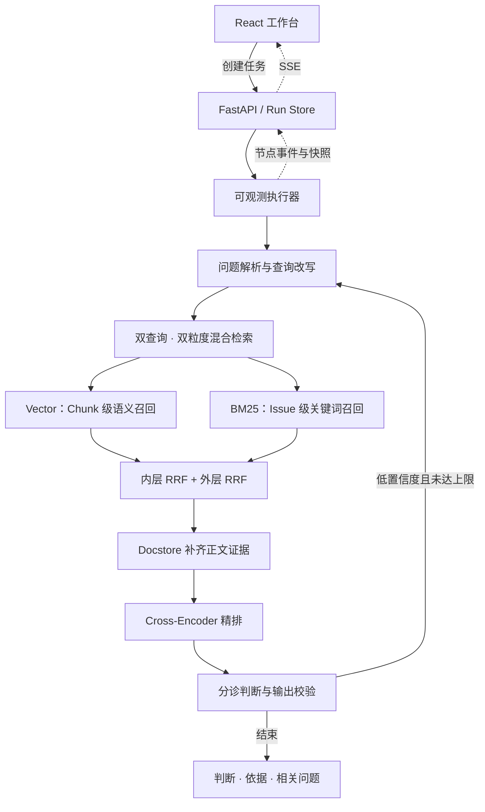

# Issue RAG Agent

**让研发问题的第一轮排查，有历史可查、有证据可审、有过程可追。**

Issue RAG Agent 是面向研发团队的 Issue 检索与辅助分诊工作台。提交问题描述后，系统检索历史记录、重排候选证据，通过 LangGraph 工作流给出重复问题、相似问题或新问题的初步判断，并展示判断依据与执行过程。

项目将 RAG 检索链路、条件重试、异步任务与实时界面整合为一个可运行的工程原型，帮助维护者在进入人工排查前找到值得复核的历史线索。

[快速启动](#快速启动) · [架构设计](#架构设计) · [实测结果](#实测结果) · [工程边界](#工程边界) · [代码阅读指南](docs/code-reading-guide.md)

---

## 从问题输入到可审阅的分诊结果

| 业务环节 | 工作台提供的能力 | 交付结果 |
| --- | --- | --- |
| 问题受理 | 标题、复现步骤与错误日志输入；预设场景载入 | 统一的分析任务 |
| 历史排查 | 关键词与语义混合检索，兼顾原始描述和改写查询 | 相关历史 Issue 候选 |
| 证据核验 | Cross-Encoder 精排，补齐候选正文并支持展开查看 | 可追溯的原文证据 |
| 初步分诊 | 三类判断、相关 Issue ID、置信值和判定依据 | 供维护者复核的处理建议 |
| 过程审阅 | SSE 事件流、节点耗时、重试记录与快照复制 | 可检查的单次运行记录 |

工作台包含 **Agent 工作台、知识与数据源、质量评估** 三个入口。界面使用统一的纸面色、墨色层级与细线分隔，把任务、证据和结论放在同一条操作路径上。

这里的 Agent 是具有条件重试的任务型工作流：四个节点按既定顺序执行，低置信度时重新组织检索。当前不包含自主工具选择、任意任务规划或多 Agent 协作。

## 架构设计



### 检索：保留两种问题表达，融合两种匹配方式

原始 Issue 和改写 Query 分别进入检索。每个查询同时使用向量检索与 BM25，再通过两层 RRF 汇总候选，避免单次改写丢失关键错误词。向量检索以 Chunk 为粒度覆盖局部语义，BM25 以 Issue 为粒度保留词项匹配，最终统一到 Issue ID。

### 证据：找到记录之后，还要补齐上下文

Docstore 为仅由 BM25 命中的候选补齐标题和正文，保证精排与决策能够读取实际内容。Cross-Encoder 默认保留 Top-5，候选分差接近时最多扩展至 Top-10。

### 决策：结构化输出，有边界地重试

决策输出限定为 `duplicate`、`similar`、`new`。相关 Issue ID 必须来自候选白名单；置信值限定在合法范围。低置信度时，将上一轮候选与诊断信息带回查询分析节点，在配置的重试上限内再次检索。

### 交付：运行过程可见，结果可以复核

FastAPI 提供任务创建、快照查询与 SSE 订阅。运行适配层记录节点状态、耗时、候选和轮次信息，前端随事件更新。同步 `/triage` 接口仍保留，便于脚本或其他服务调用。

## 实测结果

以下是仓库已有本地评测记录，**不是本次发布重新运行的结果**。原始聚合指标见 [评测摘要](docs/benchmarks/retrieval-summary.json)。

```text
语料规模：106,655 条 Issue（既有本地索引记录）
评测来源：held-out test set，抽样 200 条，seed = 42
评测处理：剔除查询自身命中

配置                 Recall@5  Recall@10    MRR    nDCG@10  P50 / s
Vector Only           0.3338     0.3965    0.2709   0.2886    0.022
BM25 Only             0.2730     0.3337    0.2492   0.2589    2.901
Hybrid RRF            0.3484     0.4257    0.2775   0.2974    3.054
Hybrid + Rerank        0.3130     0.3701    0.2292   0.2542    6.336
```

混合检索在这组样本上取得更高的 Recall@10，但通用重排模型没有带来正收益。项目保留这一结果，供后续评估是否启用精排、调整候选规模或引入领域数据时参考。

Recall 是对标注相关项的检索召回指标，不能解释为分诊分类准确率。延迟来自已有单机 CPU 记录，不含 LLM 调用；原始摘要还包含明显长尾，不能用 P50 推断线上服务能力。语料、模型和索引变化后需要重新评测。

## 快速启动

### 1. 获取项目与安装依赖

建议使用独立 Python 环境；本项目依赖包含 `numpy<2.0`，首次安装优先选择 Python 3.11 或 3.12。前端使用 Vite 8，需要 Node.js 20.19+ 或 22.12+。

```bash
git clone https://github.com/Rinta13795/issue-rag-agent.git
cd issue-rag-agent
python3.11 -m venv .venv
source .venv/bin/activate
python -m pip install -r requirements.txt
cp .env.example .env
```

在 `.env` 中填写自己的 `DEEPSEEK_API_KEY`。真实密钥不应写入源码或提交到仓库。

### 2. 准备模型和数据索引

仓库不包含原始数据、大型模型或本地索引。当前模型加载实现启用本地离线缓存，因此第一次运行前需要下载模型：

```bash
HF_HUB_OFFLINE=0 python - <<'PY'
from huggingface_hub import snapshot_download
snapshot_download('sentence-transformers/all-MiniLM-L6-v2')
snapshot_download('BAAI/bge-reranker-base')
PY

python scripts/run_step2.py
python scripts/build_eval_assets.py
```

第一步构建 Chroma 与 BM25 索引，第二步生成正文证据库与评测集。完整语料处理需要额外的时间与磁盘空间。

数据加载优先使用 Hugging Face 数据源。若数据源不可用，代码会尝试本地 mock 文件；该文件未随仓库分发，不能将失败回退视为完整语料准备成功。请根据加载日志确认实际数据量。页面展示的语料规模是既有演示元数据，不是当前索引的实时计数。

### 3. 构建界面并启动服务

```bash
cd frontend
npm ci
npm run build
cd ..
python -m uvicorn api:app --host 127.0.0.1 --port 8000
```

访问 [本地工作台](http://127.0.0.1:8000)。后端自动挂载 `frontend/dist`；首次分析会加载模型。开发时可另开终端运行前端，API 请求代理到后端：

```bash
cd frontend
npm run dev
```

前端开发地址为 [localhost:5173](http://localhost:5173)。只启动前端可以查看界面；实际分诊仍需要后端、模型和索引。

## 接口与集成

| 方法 | 路径 | 用途 |
| --- | --- | --- |
| GET | `/health` | 存活检查，不触发模型加载 |
| POST | `/triage` | 同步分诊 |
| POST | `/api/runs` | 创建异步任务，返回运行 ID |
| GET | `/api/runs/{run_id}` | 查询完整运行快照 |
| GET | `/api/runs/{run_id}/events` | 订阅 SSE 事件 |
| GET | `/api/examples` | 获取预设问题 |
| GET | `/api/system` | 查询演示元数据与索引存在状态 |
| GET | `/api/evaluation/summary` | 读取本地评测结果 |

```bash
curl -X POST http://127.0.0.1:8000/api/runs \
  -H 'Content-Type: application/json' \
  -d '{"issue_text":"Application crashes when opening account settings."}'
```

创建任务后，使用返回的 `run_id` 查询快照或订阅事件。结构化输出的字段定义见 [数据契约](src/demo/models.py)。

## 验证与复现

```bash
python -m pytest tests/ -q
cd frontend && npm run build
```

测试覆盖检索融合、正文补齐、决策校验、查询保护、运行状态和 API。部分 API 用例依赖本地索引存在；从干净环境运行时应先准备索引。测试依赖 FastAPI 的 `TestClient`，环境还需安装 `httpx`。

重新生成检索评测：

```bash
python -m eval.run_eval --limit 200
```

评测结果写入 `eval_results/`，工作台从此目录读取指标；仓库中的发布摘要不会自动作为运行时评测结果载入。

## 工程边界

- **人工复核**：输出用于辅助分诊，不自动关闭 Issue、不替代根因分析。LLM 异常时可能返回规则降级结果，需结合判定依据识别。
- **置信值未校准**：模型或降级逻辑返回的分值不是经过统计校准的正确概率。
- **本地运行模型**：默认单 Worker 执行，任务状态位于进程内；尚未实现持久化任务恢复、租户隔离、鉴权或生产级并发治理。
- **元数据限制**：现有语料缺少有效 component 元数据，在线硬过滤通过白名单保护，不能假设组件识别已完整可用。
- **报告能力**：当前可查看结果与复制 JSON 快照。此前制作的专业报告图片属于设计样稿，自动生成 PDF、正式业务报告与审批流尚未实现。

## 代码与文档导航

```text
frontend/               React + TypeScript 任务工作台
api.py                  REST、SSE 与静态资源入口
config.py               模型、检索、重排和重试配置
src/agent/              LangGraph 状态、节点与提示词
src/retrievers/         Vector、BM25 与双层 RRF
src/reranker.py         Cross-Encoder 精排
src/docstore.py         Issue 正文证据库
src/demo/               运行适配器、状态仓库与数据契约
eval/                   评测集构建、指标与实验入口
tests/                  单元与接口测试
```

- [架构与改进记录](IMPROVEMENTS.md)：设计动机、取舍与版本差异。
- [代码阅读指南](docs/code-reading-guide.md)：从入口逐步理解完整调用链。
- [实测报告](docs/10-RAG-v2项目实测报告.md)：本地验证记录与已知问题。

后续重点是领域重排评估、置信度校准、任务持久化和报告导出。路线图表示待办方向，不代表当前已经提供这些能力。
