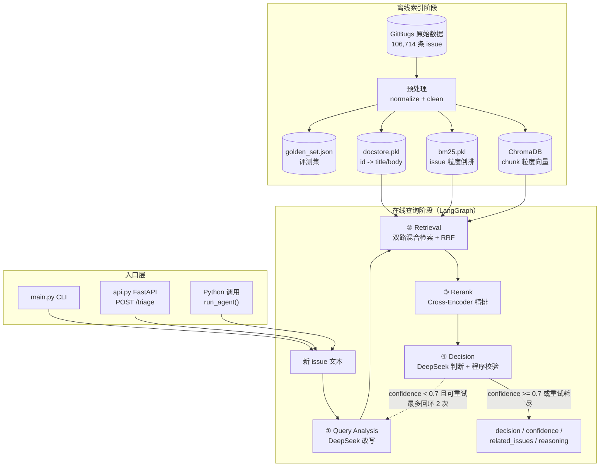
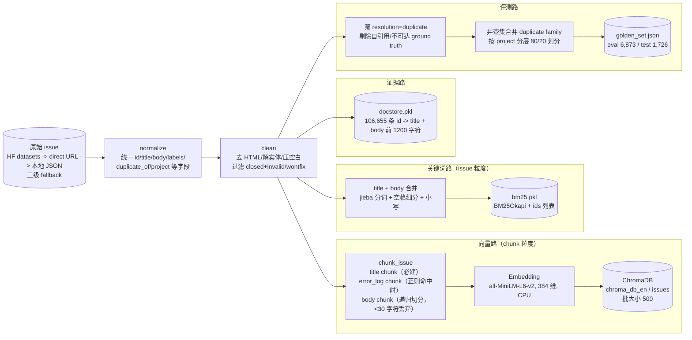
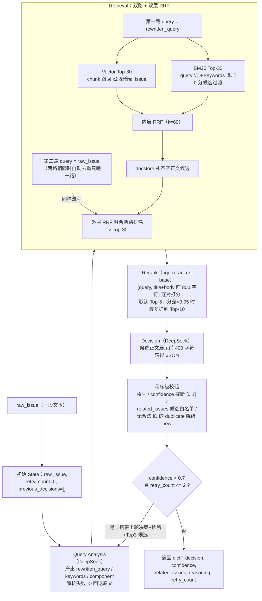
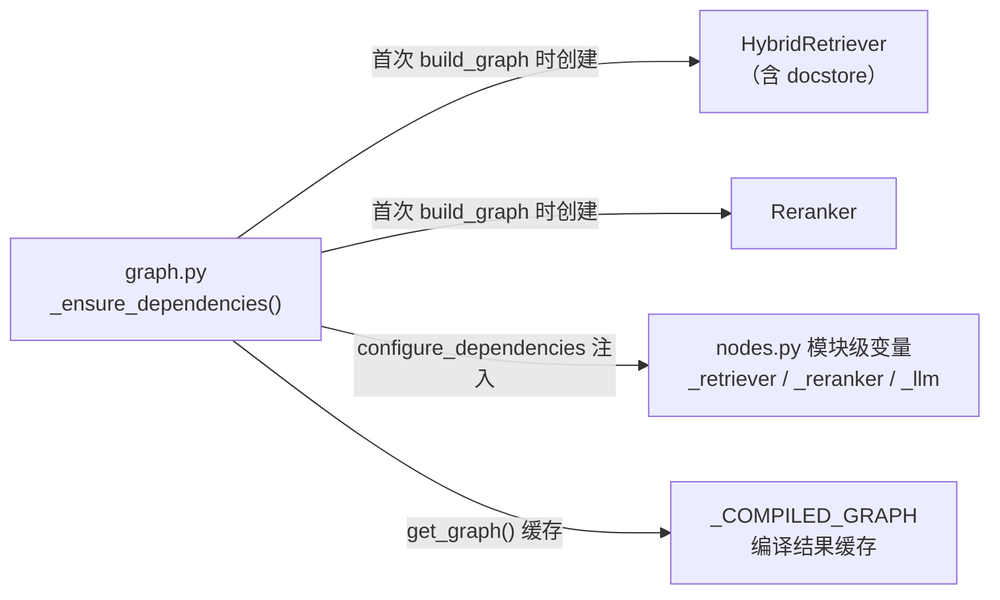

# 01 架构总览

> 本文所有结论基于 v2 实际代码，引用格式为 `文件:行号`。数据规模：本地快照 106,714 条
> issue、8 个项目（清洗后 106,656 条，`data/mock/mock_issues.json`，实际是真实 GitBugs
> 数据，文件名叫 mock 只是历史原因）。

## 1. 系统整体架构图

系统分两个阶段：**离线索引阶段**（一次性/低频，构建三份检索资产 + 评测资产）和
**在线查询阶段**（每次新 issue 进来跑一遍 LangGraph 四节点工作流）。



架构对应代码：
- 四节点与条件边组装：`src/agent/graph.py:85-119`（`build_graph`）
- 回环判断：`src/agent/graph.py:70-82`（`should_retry`：`confidence < 0.7 且 retry_count <= 2`，阈值来自 `config.py:110,113`）
- 入口：`main.py:16`、`api.py:47`、`src/agent/graph.py:133`（`run_agent`）

## 2. 数据流图（端到端）

### 2.1 离线：原始数据 → 三份索引资产 + 评测资产



各环节输入/输出与代码位置：

| 环节 | 输入 | 处理 | 输出 | 代码 |
| --- | --- | --- | --- | --- |
| 加载 | 数据源配置 | HF datasets → direct URL → 本地 JSON 三级 fallback | 原始 dict 列表 | `src/data_loader.py:142` |
| normalize | 原始 dict | 兼容多种字段名，统一 10 个标准字段 | 标准 issue | `src/data_loader.py:44-91` |
| clean | 标准 issue 列表 | BeautifulSoup 去 HTML、`html.unescape`、`\s+` 压缩；过滤 closed 且 invalid/wontfix | 干净 issue（106,714→106,656，过滤 58 条） | `src/data_loader.py:94-139` |
| chunk | 单条 issue | title 必建；error 正则切出 error_log；剩余 body 递归切分（500/80） | Document 列表 | `src/indexer.py:85-143` |
| 向量入库 | 全部 chunk | 批 500 写入，写完自召回验证 | ChromaDB | `src/indexer.py:167-206` |
| BM25 建库 | 全部 issue | title+body 分词，BM25Okapi（k1/b 用库默认） | bm25.pkl（含 ids 顺序） | `src/indexer.py:221-241` |
| docstore | 全部 issue | id → {title, body 前 1200 字符} pickle | docstore.pkl（72MB） | `src/docstore.py:16-39` |
| golden set | 全部 issue + 索引 id 集合 | 可达性过滤 + family 隔离划分（详见 06 文档） | golden_set.json | `eval/golden_set_builder.py:56-179` |

离线入口：`scripts/run_step2.py:18`（建 ChromaDB + BM25）、`scripts/build_eval_assets.py:26`
（一次预处理，同时产出 docstore + golden set，避免 10 万条 BeautifulSoup 清洗跑两遍）。

### 2.2 在线：query 进入 → 最终输出



对应代码：
- Query Analysis：`src/agent/nodes.py:165-282`（重试块拼接 `nodes.py:180-216`）
- Retrieval 节点：`src/agent/nodes.py:284-318`（keywords 传入 BM25 见 `nodes.py:311`）
- 双层 RRF：内层 `src/retrievers/hybrid_retriever.py:56-99`，外层 `hybrid_retriever.py:110-201`
- docstore 补齐：`src/retrievers/hybrid_retriever.py:203-228`
- Rerank：`src/reranker.py:25-76`（动态扩展 `reranker.py:60-70`）
- Decision + 校验：`src/agent/nodes.py:346-493`（白名单 `nodes.py:410-425`）
- 回环：`src/agent/graph.py:70-82,106-110`

## 3. 离线 vs 在线的关键区别

| 维度 | 离线索引阶段 | 在线查询阶段 |
| --- | --- | --- |
| 频率 | 一次性 / 数据更新时 | 每个新 issue 一次 |
| 耗时 | 全量向量化数小时（CPU）；docstore+golden set 约 3 分钟 | 检索+精排约 7 秒（冒烟实测，CPU，不含 LLM） |
| LLM 参与 | 无 | Query Analysis 与 Decision 各 1 次/轮，最多 3 轮 |
| 产物 | chroma_db_en/、bm25.pkl、docstore.pkl、golden_set.json | 单次决策 dict |
| 粒度 | Chroma 存 chunk，BM25/docstore 存 issue | 全程 issue 粒度（向量结果先按 issue_id 聚合，`src/retrievers/vector_retriever.py:35-56`） |

## 4. 目录结构与模块职责

```text
RAG项目-v2/
├── config.py                  # 全部超参数与路径，35 个配置项（config.py:14-135）
├── main.py                    # CLI 入口，支持参数/stdin/--json
├── api.py                     # FastAPI：GET /health + POST /triage
├── scripts/
│   ├── run_step2.py           # 离线建库入口（ChromaDB + BM25）
│   ├── build_eval_assets.py   # docstore + golden set 一次性构建
│   ├── smoke_test.py          # 端到端冒烟：offline 假 LLM / --live 真调用
│   └── resume_index.py        # 断点续建索引（v1 遗留工具）
├── src/
│   ├── data_loader.py         # 三级 fallback 加载、normalize、clean
│   ├── indexer.py             # error 正则切分、chunk、Embedding、双索引构建
│   ├── docstore.py            # issue_id -> {title, body} 构建与加载
│   ├── reranker.py            # Cross-Encoder 精排（copy 后打分，无副作用）
│   ├── retrievers/
│   │   ├── vector_retriever.py   # Chroma chunk 召回 -> issue 聚合
│   │   ├── bm25_retriever.py     # BM25 全量打分 + keywords 追加 + 0 分过滤
│   │   └── hybrid_retriever.py   # 双层 RRF 融合 + docstore 补齐
│   └── agent/
│       ├── state.py           # IssueState TypedDict（12 个字段）
│       ├── graph.py           # 依赖注入、图构建与缓存、run_agent
│       ├── nodes.py           # 四个节点实现 + JSON 解析 + 输出校验
│       └── prompts/           # 3 个 Markdown prompt（带 frontmatter，运行时剥离）
├── eval/
│   ├── golden_set_builder.py  # 可达性过滤 + 并查集 family 划分
│   ├── metrics.py             # Recall/Precision/MRR/nDCG（IDCG 按全量相关数）
│   ├── run_eval.py            # 4 配置评估：自命中剔除、固定 seed 抽样
│   ├── report.py              # 对比表打印（含评估元信息）
│   └── benchmarks/            # retry 质量 / 双路召回两个 benchmark 框架
├── tests/                     # 6 个文件、32 个用例（全部通过）
├── docs/                      # 本文档系列 + 代码阅读地图
├── IMPROVEMENTS.md            # v1 -> v2 全部 20 项改进及动机
└── CLAUDE.md                  # 协作规范与项目事实
```

## 5. 依赖注入与初始化设计

重模型（Embedding、Reranker、Chroma、BM25 pickle、docstore）全部**惰性加载且只加载一次**：



- `import run_agent` 不加载任何重依赖（`src/agent/graph.py:23-46` 中函数内 import）
- 依赖单例：`graph.py:56-67`；LLM 客户端创建：`src/agent/nodes.py:137-163`
  （timeout=60s、max_retries=2，`config.py:29,32`）
- 图编译缓存：`graph.py:121-130`（v1 每次 `run_agent` 都重新构图）

## 6. 一句话总结

**离线**把 10 万条 issue 变成"语义索引（Chroma chunk）+ 关键词索引（BM25 issue）+
正文证据库（docstore）"三份资产；**在线**用 LangGraph 把"LLM 改写 → 双路混合召回 →
Cross-Encoder 精排 → LLM 决策 + 程序校验"串成带低置信度回环的固定工作流，输出
可核查（related_issues 全部真实存在于候选中）的 duplicate/similar/new 判断。
