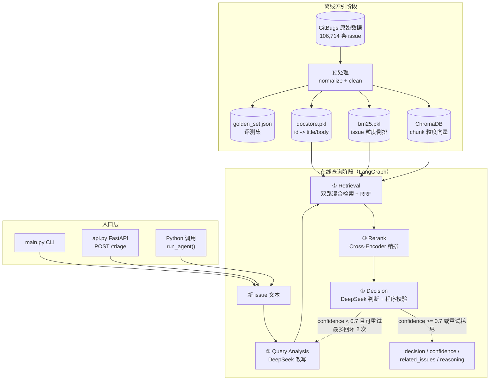
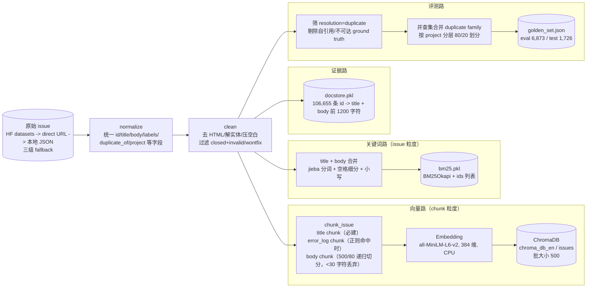
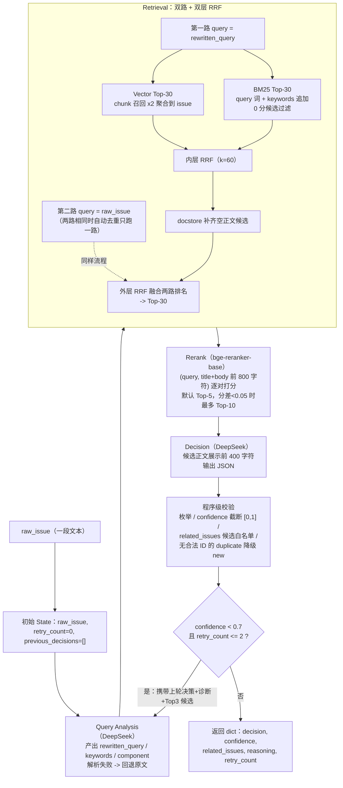

# 01a 架构总览（上）：整体架构与数据流

## 📌 项目速览（每个文档都重复，便于单独阅读）

Issue 查重系统：新 issue 提交后，在 106,714 条历史 issue（GitBugs 数据集，8 个开源项目）里找重复，输出 duplicate / similar / new 三分类 + 置信度 + 相关 issue 编号 + 判断理由。在线流程是 LangGraph 四节点：LLM 改写 query → 双路混合检索（BM25 + 向量各 Top-30，双层 RRF 融合，docstore 补齐正文）→ Cross-Encoder 精排 Top-5 → LLM 决策 + 程序级校验；置信度 < 0.7 且未超 2 次重试时带诊断回环重写。技术栈：Python、LangGraph、DeepSeek、ChromaDB（all-MiniLM-L6-v2，384 维）、rank-bm25、bge-reranker-base、FastAPI。

> 数据规模：本地快照 106,714 条 issue、8 个项目（清洗后 106,656 条；文件名叫
> mock_issues.json 只是历史原因，实际是真实 GitBugs 数据）。
> 下篇（01b）：目录结构、模块职责、依赖注入与初始化设计。

## 1. 系统整体架构图

系统分两个阶段：**离线索引阶段**（一次性/低频，构建三份检索资产 + 评测资产）和
**在线查询阶段**（每次新 issue 进来跑一遍 LangGraph 四节点工作流）。



回环判断的实际代码（`src/agent/graph.py`）：

```python
def should_retry(state: IssueState) -> str:
    # CONFIDENCE_THRESHOLD = 0.7；MAX_RETRIES = 2
    # retry_count 是 Decision 累计执行轮数（每轮先 +1），所以最多 3 整轮。
    if state["confidence"] < CONFIDENCE_THRESHOLD and state["retry_count"] <= MAX_RETRIES:
        return "retry"
    return "end"
```

## 2. 数据流图（端到端）

### 2.1 离线：原始数据 → 三份索引资产 + 评测资产



各环节输入/处理/输出（代码均已内嵌到对应详解文档，此处给流转事实）：

| 环节 | 输入 | 处理 | 输出 |
| --- | --- | --- | --- |
| 加载 | 数据源配置 | HF datasets → direct URL → 本地 JSON 三级 fallback | 原始 dict 列表 |
| normalize | 原始 dict | 兼容多种字段名（id/issue_id、body/description…），统一 10 个标准字段 | 标准 issue |
| clean | 标准 issue 列表 | BeautifulSoup 去 HTML、解码实体、`\s+` 压缩；过滤 closed 且 invalid/wontfix | 106,714→106,656（过滤 58 条） |
| chunk | 单条 issue | title 必建；error 正则切出堆栈段；剩余 body 500/80 递归切分 | Document 列表（代码见 03b 决策 6） |
| 向量入库 | 全部 chunk | 批 500 写入 ChromaDB，写完自召回验证 | chroma_db_en/（1.8G） |
| BM25 建库 | 全部 issue | title+body 分词 → BM25Okapi（k1/b 库默认） | bm25.pkl（101M，含 ids 顺序） |
| docstore | 全部 issue | id → {title, body 前 1200 字符} | docstore.pkl（72M）（代码见 03a 决策 4） |
| golden set | 全部 issue + 索引 id 集合 | 可达性过滤 + family 隔离划分 | golden_set.json（代码见 06a） |

normalize/clean 的核心实现（`src/data_loader.py` 节选）：

```python
def normalize(raw_issue: dict) -> dict:
    # 兼容不同数据源的字段命名差异，统一成 10 个标准字段
    issue_id = _get_first(raw_issue, ["id", "issue_id", "issueId"], "")
    title = _get_first(raw_issue, ["title", "name", "summary"], "")
    body = _get_first(raw_issue, ["body", "description", "content", "text"], "")
    duplicate_of = _to_str_list(_get_first(raw_issue, ["duplicate_of", "duplicate_of_id", "dup_of_id"], []))
    # ... labels/component/status/resolution/project/created_at 同理
    return {"id": str(issue_id), "title": str(title), "body": str(body), ...}

def clean(issues: list[dict]) -> list[dict]:
    cleaned = []
    for issue in issues:
        # 过滤误导型噪声：closed 且 resolution 是 invalid/wontfix 的历史 issue
        if str(issue.get("status", "open")).lower() == "closed" \
           and str(issue.get("resolution", "")).lower() in ("invalid", "wontfix"):
            continue
        for field in ("title", "body"):
            text = BeautifulSoup(str(issue.get(field, "")), "html.parser").get_text(" ")
            text = html.unescape(text)                      # &amp; -> &
            issue[field] = re.sub(r"\s+", " ", text).strip()  # 压缩空白
        cleaned.append(issue)
    return cleaned
```

### 2.2 在线：query 进入 → 最终输出



各节点的完整内嵌代码：Query Analysis 与检索见 02a；Rerank、Decision 校验、回环
见 02b；设计动机见 03a/03b。

## 3. 离线 vs 在线的关键区别

| 维度 | 离线索引阶段 | 在线查询阶段 |
| --- | --- | --- |
| 频率 | 一次性 / 数据更新时 | 每个新 issue 一次 |
| 耗时 | 全量向量化数小时（CPU）；docstore+golden set 约 3 分钟 | 检索+精排约 7 秒（冒烟实测，CPU，不含 LLM） |
| LLM 参与 | 无 | Query Analysis 与 Decision 各 1 次/轮，最多 3 轮 |
| 产物 | chroma_db_en/、bm25.pkl、docstore.pkl、golden_set.json | 单次决策 dict |
| 粒度 | Chroma 存 chunk，BM25/docstore 存 issue | 全程 issue 粒度（向量结果先按 issue_id 聚合） |

### ✅ 自测（架构与数据流）

1. 离线阶段的四份产物分别是什么、各自的粒度是什么？
2. 一条 query 在线要经过哪四个节点？哪个节点可能触发回环、条件是什么？
3. clean 阶段过滤什么样的 issue、为什么？normalize 为什么必须在 clean 之前？

---

## 自测答案

<details>
<summary>答案</summary>

1. ChromaDB 向量库（chunk 粒度）、bm25.pkl 倒排（issue 粒度）、docstore.pkl 正文
   映射（issue 粒度）、golden_set.json 评测集（query 粒度，family 隔离划分）。
2. Query Analysis → Retrieval → Rerank → Decision。Decision 后的 should_retry
   条件边：`confidence < 0.7 且 retry_count <= 2` 时回到 Query Analysis 重跑
   一整轮，最多 3 轮。
3. 过滤 closed 且 resolution 为 invalid/wontfix 的 issue——它们是"被判定无效"的
   历史，检索出来会误导 Decision。normalize 在前是因为 clean 要读 status/
   resolution 等字段，字段名必须先统一（v1 的评估链路恰恰漏了 normalize，是
   v2 修复的坑之一）。
</details>
