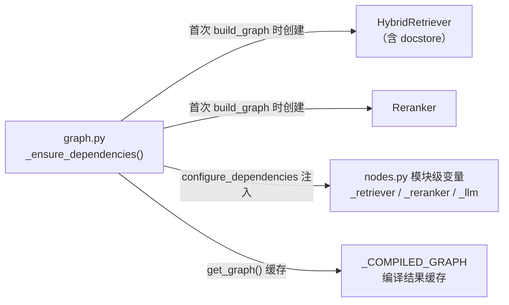

# 01b 架构总览（下）：目录职责与初始化设计

## 📌 项目速览（每个文档都重复，便于单独阅读）

Issue 查重系统：新 issue 提交后，在 106,714 条历史 issue（GitBugs 数据集，8 个开源项目）里找重复，输出 duplicate / similar / new 三分类 + 置信度 + 相关 issue 编号 + 判断理由。在线流程是 LangGraph 四节点：LLM 改写 query → 双路混合检索（BM25 + 向量各 Top-30，双层 RRF 融合，docstore 补齐正文）→ Cross-Encoder 精排 Top-5 → LLM 决策 + 程序级校验；置信度 < 0.7 且未超 2 次重试时带诊断回环重写。技术栈：Python、LangGraph、DeepSeek、ChromaDB（all-MiniLM-L6-v2，384 维）、rank-bm25、bge-reranker-base、FastAPI。

> 上篇（01a）：整体架构图、离线/在线数据流。

## 4. 目录结构与模块职责

```text
RAG项目-v2/
├── config.py                  # 全部超参数与路径，35 个配置项（唯一配置来源）
├── main.py                    # CLI 入口，支持参数/stdin/--json
├── api.py                     # FastAPI：GET /health + POST /triage
├── scripts/
│   ├── run_step2.py           # 离线建库入口（ChromaDB + BM25）
│   ├── build_eval_assets.py   # docstore + golden set 一次性构建（清洗一遍产出两份）
│   ├── smoke_test.py          # 端到端冒烟：默认离线假 LLM / --live 真调用
│   └── resume_index.py        # 断点续建索引（v1 遗留工具）
├── src/
│   ├── data_loader.py         # 三级 fallback 加载、normalize、clean
│   ├── indexer.py             # error 正则切分、chunk、Embedding、双索引构建
│   ├── docstore.py            # issue_id -> {title, body} 构建与加载
│   ├── reranker.py            # Cross-Encoder 精排（copy 后打分，无副作用）
│   ├── retrievers/
│   │   ├── vector_retriever.py   # Chroma chunk 召回 -> issue 聚合
│   │   ├── bm25_retriever.py     # BM25 全量打分 + keywords 追加 + 0 分过滤
│   │   └── hybrid_retriever.py   # 双层 RRF 融合 + docstore 补齐
│   └── agent/
│       ├── state.py           # IssueState TypedDict（12 个字段）
│       ├── graph.py           # 依赖注入、图构建与缓存、run_agent
│       ├── nodes.py           # 四个节点实现 + JSON 解析 + 输出校验
│       └── prompts/           # 3 个 Markdown prompt（frontmatter 运行时剥离）
├── eval/
│   ├── golden_set_builder.py  # 可达性过滤 + 并查集 family 划分
│   ├── metrics.py             # Recall/Precision/MRR/nDCG（IDCG 按全量相关数）
│   ├── run_eval.py            # 4 配置评估：自命中剔除、固定 seed 抽样
│   ├── report.py              # 对比表打印（含评估元信息）
│   └── benchmarks/            # retry 质量 / 双路召回两个 benchmark 框架
├── tests/                     # 6 个文件、32 个用例（全部通过）
├── docs/                      # 本文档系列
├── IMPROVEMENTS.md            # v1 -> v2 全部 20 项改进及动机
└── CLAUDE.md                  # 协作规范与项目事实
```

共享状态定义（`src/agent/state.py` 完整）：

```python
class IssueState(TypedDict):
    # run_agent 初始化：原始输入 + 循环控制
    raw_issue: str
    retry_count: int
    previous_decisions: NotRequired[List[dict]]
    # query_analysis_node 写入
    rewritten_query: str
    keywords: List[str]
    component: Optional[str]
    # retrieval_node 写入：Top-30 融合候选
    retrieved_docs: List[dict]
    # rerank_node 写入：Top-5（动态最多 10）
    reranked_docs: List[dict]
    # decision_node 写入：最终判断
    decision: str
    confidence: float
    related_issues: List[str]
    reasoning: str
```

## 5. 依赖注入与初始化设计

重模型（Embedding、Reranker、Chroma、BM25 pickle、docstore）全部**惰性加载且
只加载一次**。设计目标：`import run_agent` 零开销；同进程反复调用零重复加载。



核心实现（`src/agent/graph.py` + `src/agent/nodes.py` 节选）：

```python
# graph.py —— 惰性创建重依赖：函数内 import，避免 import run_agent 时提前加载模型
def get_hybrid_retriever():
    from langchain_chroma import Chroma
    from src.docstore import load_docstore
    from src.indexer import load_embeddings
    # ... 其余 import
    vectorstore = Chroma(collection_name=CHROMA_COLLECTION,
                         embedding_function=load_embeddings(),
                         persist_directory=CHROMA_PERSIST_DIR)
    return HybridRetriever(VectorRetriever(vectorstore), BM25Retriever(),
                           docstore=load_docstore())   # docstore 缺失时退回空 dict

_DEPENDENCIES_READY = False
def _ensure_dependencies():
    """整个进程只初始化一次：检索器 + 精排器创建后注入 nodes 模块。"""
    global _HYBRID_RETRIEVER, _RERANKER, _DEPENDENCIES_READY
    if _DEPENDENCIES_READY:
        return
    _HYBRID_RETRIEVER = get_hybrid_retriever()
    _RERANKER = get_reranker()
    configure_dependencies(_HYBRID_RETRIEVER, _RERANKER)
    _DEPENDENCIES_READY = True

# nodes.py —— 依赖注入落点：节点函数通过模块级变量复用同一组实例
def configure_dependencies(retriever, reranker):
    global _retriever, _reranker, _llm
    _retriever, _reranker = retriever, reranker
    # timeout/max_retries 兜网络异常：v1 没配置，网络卡住时节点会无限阻塞
    _llm = ChatOpenAI(model=DEEPSEEK_MODEL, api_key=DEEPSEEK_API_KEY,
                      base_url=DEEPSEEK_BASE_URL, temperature=LLM_TEMPERATURE,
                      max_tokens=LLM_MAX_TOKENS, timeout=LLM_TIMEOUT,
                      max_retries=LLM_MAX_RETRIES)
```

为什么不把检索器/精排器放进 State：State 是每次请求的数据容器，会被 LangGraph
合并复制；大对象放模块级单例，State 只放数据。

配置加载的一个真实坑（`config.py`）：

```python
# override=True：项目 .env 优先于 shell 继承的同名环境变量。
# 实际踩坑：shell 里残留失效的 DEEPSEEK_API_KEY 时，load_dotenv() 默认不覆盖
# 已有环境变量，会静默用旧 key 导致 401——报错里的 key 尾号和 .env 对不上才发现。
load_dotenv(override=True)
```

## 6. 一句话总结

**离线**把 10 万条 issue 变成"语义索引（Chroma chunk）+ 关键词索引（BM25 issue）+
正文证据库（docstore）"三份资产；**在线**用 LangGraph 把"LLM 改写 → 双路混合召回 →
Cross-Encoder 精排 → LLM 决策 + 程序校验"串成带低置信度回环的固定工作流，输出
可核查（related_issues 全部真实存在于候选中）的 duplicate/similar/new 判断。

### ✅ 自测（目录与初始化）

1. 为什么检索器/Reranker 不放进 LangGraph 的 State，而是用模块级变量注入？
2. `import run_agent` 时会加载模型吗？重模型在什么时机、被谁初始化？
3. `load_dotenv(override=True)` 防的是哪个真实事故？默认行为是什么？

---

## 自测答案

<details>
<summary>答案</summary>

1. State 是每次请求的数据容器，节点返回后会被合并复制；把大模型对象放进去既浪费
   又语义错误。依赖用模块级单例（configure_dependencies 注入），State 只装数据。
2. 不会。get_hybrid_retriever/get_reranker 里的 import 都在函数体内，首次
   build_graph（即首次 run_agent）时才由 _ensure_dependencies 创建，且进程内
   只创建一次；编译后的图也由 get_graph 缓存。
3. 防"shell 里残留失效的同名环境变量压过项目 .env"：load_dotenv 默认**不覆盖**
   已存在的环境变量，项目曾因此静默用了一个过期 key 打出 401，报错中 key 尾号
   与 .env 不一致才定位到。override=True 让项目 .env 显式优先。
</details>
