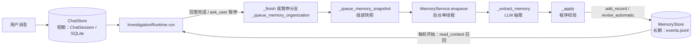

# 11 记忆机制实现梳理

> **范围**：对话调查（`src/chat/`）的短期记忆、长期记忆、写入、召回与上下文管理。
> **依据**：提交 `a548746` 的代码静态阅读，未实际运行。行号会随后续提交变化，以「文件路径 + 函数名」为准。

## 📌 速览

- 记忆机制只在**对话调查**里有。单次分诊（LangGraph 四节点）没有长期记忆，只有单次运行内的 State。
- 写入长期记忆**既不按关键词频次，也不按固定轮次**：每轮结束都在后台整理一次，写什么由 LLM 判断，再由程序校验。
- 存的不是对话原文，而是 **LLM 写的结构化短句 + 程序核对过的原文摘录 + 元数据**。
- 召回用**字符二元组（bigram）重叠**打分，不是向量检索。
- 项目里**没有**按 token 占比预警或自动压缩的机制，靠的是固定预算和字符截断。



## 一、短期记忆与长期记忆

### 1.1 短期记忆（三层）

| 层次 | 数据结构 | 存在哪里 | 保留多久 | 代码 |
| --- | --- | --- | --- | --- |
| 轮内工作记忆 | LangChain 消息列表 `messages`，工具结果缓存 `cache`（dict） | 进程内存；`messages` 同步存到 `ChatSession.runtime_messages` | 只在一轮内有效，下一轮重新组装。例外：ask_user 暂停后恢复时整份读回 | `src/chat/runtime.py` `InvestigationRuntime.run` 138-160、212-219 |
| 会话记忆 | `ChatSession`（pydantic），主要字段有 `messages`、`evidence`、`candidates`、`runtime_steps`、`pending_question`、`memory_case_id`、`investigation_summary`、`selected_memory_context`、`runtime_memory_snapshot` | `ChatStore._sessions`（OrderedDict），加上 SQLite `.local/chat_sessions.sqlite3` 的 `chat_sessions` 表；整个会话序列化成一列 JSON | 7 天过期；最多 20 个会话；消息留最近 80 条；证据留 60 条，每条正文最多 24000 字；步骤留 100 条。流式预览 `streaming_answer` 不落盘 | `src/chat/models.py` `ChatSession`（167）；`src/chat/store.py` `ChatStore`（18）、`_persist`（74-84）、`get_chat_store`（325-330）；上限在 `config.py` 41-43 |
| 单次分诊 State | `IssueState`（TypedDict），`previous_decisions` 记录每一轮的决策 | 进程内存 | 一次 `run_agent` 结束就丢 | `src/agent/state.py` |

### 1.2 长期记忆

**存三种内容：**

- **偏好**（preference）：用户的处理习惯，可以跨仓库（global），也可以只限当前仓库。
- **经验条目**（experience）：大多挂在某个问题案例上（带 `case_id`），记录调查中的观察、计划、假设、尝试、结果；手动确认的经验可以不挂案例。
- **案例摘要**（`MemoryCase.summary`）：一个问题的滚动调查摘要。

**数据结构**（`src/chat/models.py`）：

- `MemoryRecord`（89-103）：主要字段有正文 `text`、原文摘录 `source_excerpt`、`kind`、`scope`。
  - 状态 `status` 有六种：observed / active / pending / supported / verified / refuted。
  - 验证范围 `verification_scope` 有三种：unspecified / problem / solution。
  - 还有 `entry_type`、`case_id`、来源列表 `source_refs`、`supporting_sessions`、`revision` 和 `revision_history`、`modified_by`。
- `MemoryCase`（106-114）：`case_id`、`repository_id`、`title`、`summary`、源 Issue 的 ID 和链接、`session_ids`、`updated_at`。
- `MemorySourceRef`（72-78）、`MemoryRevision`（80-86）。

**存储位置**（`src/chat/memory.py` 的 `MemoryStore`，第 28 行）：

| 文件 | 作用 |
| --- | --- |
| `.local/issue-rag-memory/events.jsonl` | 唯一的事实来源，只追加事件：新增、更新、删除、案例更新、开关切换 |
| `.local/issue-rag-memory/jobs.jsonl` | 后台整理任务的状态和 LLM 抽取结果 |
| `MEMORY.md`、`repositories/<仓库>/MEMORY.md`、`cases/<case_id>.md` | 每次写入后由 `_render_markdown`（396-448）重新生成的可读文件，只给人看，程序不从这里读 |

启动时 `_restore`（83-126）把事件回放到内存字典 `_records`、`_cases`、`_jobs`、`_tombstones`。入口是 `get_memory_store`（454-460）。旧版存在 SQLite 里的记忆由 `_migrate_legacy_sqlite`（463）一次性导入。`.local/` 在 `.gitignore` 里，不进仓库。

## 二、短期记忆什么时候写入长期记忆

触发是**每轮结束后台整理一次**（事件驱动）。**写不写、写什么由 LLM 判断**，然后程序按规则校验、降级。关键词和频次只在"校验"环节起作用。代价是每完成一轮，就多一次模型调用。

### 2.1 三条写入路径

| 路径 | 什么时候触发 | 谁来判断 | 调用链 |
| --- | --- | --- | --- |
| **自动整理**（主路径） | 每轮助手回复落盘后；或模型向用户提问暂停时 | LLM 抽取，程序校验 | `ChatService._finish`（service.py 152-166）或 runtime.py 239-240 → `_queue_memory_organization`（168） → `_queue_memory_snapshot`（175-213） → `MemoryService.enqueue`（memory_service.py 52） → `_process`（137-156） → `ChatService._extract_memory`（service.py 94-108） → `MemoryService._apply`（164-279） |
| **"解决了"规则** | 当前用户消息只有一句"我解决了""搞定了"这类话 | 正则，不用 LLM | `is_unspecified_resolution`（final_response.py 54-57） → `_apply` 174-199 |
| **手动提炼** | 用户点"手动补充经验"，再确认 | LLM 提炼，核对原文，再由用户确认 | `POST .../memory-proposal`（api.py 422） → `create_memory_proposal`（service.py 251-276） → `POST .../memory`（api.py 436） → `take_memory_proposal`（store.py 301） → `MemoryStore.add`（memory.py 136-155） |

触发点代码（`src/chat/service.py` `_finish`，164-166）：

```python
self.store.update(session_id, update)
if self.memory_store.auto_capture:
    self._queue_memory_organization(session_id)
```

### 2.2 自动整理的具体条件

- **前置条件**：
  - 自动整理开关 `auto_capture` 开着。用文件存储时默认开；`PATCH /api/chat/memory-settings` 会调 `set_auto_capture`（memory.py 345）来改。
  - 会话已绑定仓库，并且至少有一条用户消息和一条助手消息（service.py 175-185）。
- **不触发的情况**：本轮失败（不经过 `_finish`）；没绑定仓库的旧会话。
- **只能写偏好、写不了经验条目的情况**：经验条目必须挂在问题案例上（memory_service.py 242 的 `elif case_id`）。案例由 `_ensure_case`（service.py 127-150）在下面这些时候创建或关联：
  - 模型调用了 search_issues、read_issue、read_pr、search_prs、draft_issue 中的任一个（runtime.py 76-120）
  - 会话导入了源 Issue（131-133）
  - 模型发起 ask_user 暂停（230）
  - 从历史案例继续（api.py 257-276）

  所以纯聊天只能沉淀偏好。
- **可靠性**：
  - 任务按 `session_id:message_id` 去重（memory.py `enqueue_job` 354-372）。
  - LLM 的抽取结果先存进 jobs.jsonl（`save_job_extraction` 374），再应用，崩溃后不会重复调模型。
  - 重启时把"处理中"的任务改回"排队"，然后自动重跑（memory.py 124-126；memory_service.py `__init__` 27-40）。
  - 单线程后台执行，不阻塞回答。

### 2.3 关键词和频次在哪里起作用（都只用于校验）

- **状态关键词**（memory_service.py 219-223）：
  - LLM 标为 verified 时，要求来源是用户原话，并且含"我确认、我验证、测试通过、确实有效、解决了、已修复"之一。
  - 标为 refuted 时，要求含"无效、没用、失败、没有解决、不管用、仍然、排除"之一。
  - 不满足就降级：来源是 Issue、PR、候选的降为 supported，其余降为 pending。

  ```python
  status = entry.get("status") if entry.get("status") in ("pending", "supported", "verified", "refuted") else "pending"
  if status in ("verified", "refuted"):
      markers = ("我确认", "我验证", "测试通过", "确实有效", "解决了", "已修复") if status == "verified" else ("无效", "没用", "失败", "没有解决", "不管用", "仍然", "排除")
      if source_ref.source_type != "user_message" or not any(marker in source_ref.excerpt for marker in markers):
          status = "supported" if source_ref.source_type in ("candidate", "source_issue", "tool_evidence") else "pending"
  ```

- **长期偏好关键词** `_LONG_TERM_MARKERS`（18-21，包括"以后、每次、我习惯、请记住"等）：LLM 标为明确偏好，并且原话里有这些词，才算明确偏好（257-258）。
- **频次**：推断出来的偏好要在至少 2 个不同会话里出现，才从 observed 升为 active（263-267；memory.py `add_record` 174-176）。

  ```python
  long_term = any(marker in excerpt for marker in _LONG_TERM_MARKERS)
  explicit = bool(preference.get("explicit")) and long_term
  ...
  status = "active" if explicit or len(distinct_sessions) >= 2 else "observed"
  ```

### 2.4 一处文档和代码不一致

`docs/issue-case-workflow.md` 第 50 行说，消息里说"记住这个"也可以触发提炼。那是旧规划器的 `propose_memory` 动作（`src/chat/prompts.py` 的 `PLANNER_SYSTEM`、`src/chat/context.py` 的 `validate_plan`），现在的调用链已经不经过它了。现在消息里说"请记住"，只会让自动整理把这条偏好判为明确偏好。

## 三、存的是原文，还是处理后的内容

**不存对话原文。** 长期记忆存的是：**LLM 写的结构化短句，加上程序核对过的原文摘录，再加类型、状态、来源、版本这些元数据。** 原文只留在短期的 `ChatSession` 里。

| 步骤 | 做什么 | 位置 |
| --- | --- | --- |
| 1. 组装快照 | 收集案例摘要、本轮工具证据的 ID、最近 12 条证据、本案例的已有记录和全部偏好（最多 30 条）、最近 6 条用户消息（每条最多 600 字）、助手回答（最多 1200 字）、源 Issue（正文最多 2200 字）、候选（最多 3 条） | service.py `_queue_memory_snapshot` 175-213 |
| 2. 裁成有界输入 | 摘要最多 1200 字；只留最近 3 条用户消息；Issue 正文最多 1000 字；已有记录最多 12 条；**只带本轮的工具证据**，每条最多 1000 字。整体超过 16000 字时，依次丢已有记录、工具证据、候选；只剩基础部分还超就报错 | memory_prompt.py `memory_prompt_payload` 9-47 |
| 3. LLM 抽取 | 输出 JSON：`summary`（最多 1200 字）、`entries`（最多 8 条）、`preferences`（最多 4 条）。每条带类型、正文、状态、来源和原文摘录；要修订旧记录时带旧记录的 ID | service.py `_extract_memory` 94-108；提示词 prompts.py `MEMORY_ORGANIZER_SYSTEM` 32-41 |
| 4. 程序校验 | 规则见下 | memory_service.py `_apply` 164-279、`_resolve_source` 281-308 |
| 5. 落盘 | 去重合并、修订、更新案例摘要、重新生成 Markdown | memory.py `add_record` 157-200、`revise_automatic` 202-226、`update_case_summary` 330-343、`_render_markdown` 396-448 |

### 3.1 第 4 步的校验规则

- **摘录必须对得上原文。** 它必须是来源原文里的一段连续文字，来源可以是用户消息、源 Issue、工具证据的完整正文、候选摘录。对不上就整条丢掉（`_resolve_source`）。
- **状态按 2.3 节的关键词规则降级。** `verification_scope=solution` 只接受用户原话作为来源（233）。
- **截断长度**：经验条目正文最多 500 字，偏好最多 300 字，摘录最多 240 字。
- **重复应用不会产生重复记录。** `memory_id` 由会话、消息、来源、摘录和类型算哈希得到。
- **修订旧记录有保护。** 带旧记录 ID 的走 `revise_automatic`；用户手动改过的、或者版本号已经变了的，不会被覆盖。
- **删过的不会自动长回来。** 删除时写入"墓碑"（`delete` 255-270），之后自动整理不会重新生成它（214、255）。
- **偏好的额外规则**：来源必须是用户消息；只针对"这一次"、又不是明确偏好的，直接丢掉；只有明确偏好才能设为全局（260-262）。

### 3.2 落盘时的去重

`add_record`（164-196）：类型、案例、仓库相同，正文忽略大小写后也相同，就视为同一条。合并时补充支持它的会话和来源，状态只升不降（pending < supported < verified / refuted），同时记一条修订历史。

### 3.3 一条记录大概长这样（示意，不是真实数据）

```json
{
  "kind": "experience", "entry_type": "attempt", "status": "refuted",
  "text": "用户按关联 PR 的补丁修改后，INFO 日志仍然出现",
  "source_excerpt": "还是有 INFO 日志",
  "source_refs": [{"source_type": "user_message", "source_id": "msg_…", "excerpt": "还是有 INFO 日志"}],
  "case_id": "case_…", "revision": 2, "modified_by": "automatic"
}
```

## 四、长期记忆怎么被召回、注入回上下文

**时机**：每轮开始时，在 `InvestigationRuntime.run` 里（runtime.py 145-154）；ask_user 暂停后恢复的那一轮除外。召回用的查询是**当前用户消息加源 Issue 标题**（146）。

### 4.1 召回：`MemoryService.read_context`（memory_service.py 77-103）

| 内容 | 怎么选 | 代码 |
| --- | --- | --- |
| 偏好 | 本仓库和全局的 active 偏好，按创建时间取**最新 3 条**，不看相关度 | memory.py `select` 272-281 |
| 不挂案例的经验 | 按字符二元组（bigram）的重叠数量打分，先取前 3 条，再过滤掉挂了案例的 | 同上；memory_service.py 80-81 |
| 案例 | 用标题、摘要和案例条目算 bigram 重叠分，取前 3 个；当前案例固定排第一，总数最多 4 个；每个案例带最新 3 条条目 | memory.py `select_cases` 314-328；memory_service.py `_case_payload` 120-135 |
| 长度预算 | 序列化后超过 4000 字就逐步删：先删最后一个案例的条目，再删案例，再删偏好，最后删经验 | 91-102 |

召回比较的是**字面上的字符重叠**，不是向量检索，也不调用 LLM。

```python
# src/chat/memory.py  MemoryStore.select（272-281）
records = self.list(repository_id)
preferences = [item for item in records if item.kind == "preference" and item.status == "active"][:3]
query_grams = _bigrams(query)
cases = [item for item in records if item.kind == "experience"
         and item.repository_id == repository_id and item.status != "refuted"]
scored = sorted(((len(_bigrams(item.text) & query_grams), item) for item in cases),
                key=lambda pair: pair[0], reverse=True)
chosen = preferences + [item for score, item in scored if score > 0][:3]
```

### 4.2 注入（runtime.py 147-153）

1. **组成调查上下文**：仓库 ID、源 Issue（最多 4000 字）、当前焦点、候选、**案例摘要** `investigation_summary`、**召回的记忆**、最近 6 条证据（每条最多 2000 字）。
2. **放进对话里**：把上面整个包成一条 `SystemMessage("调查上下文：{JSON}")`，插在最近 10 条对话之后、当前用户消息之前。
   - 代码注释说明了原因（152）：稳定的历史放在前面，会变的记忆和证据放在后面，前缀不变，有利于命中缓存。
   - 对应测试：`tests/test_chat_cost_context.py::test_dynamic_context_follows_unchanged_history_and_precedes_current_user`。
3. **用法约束**：系统提示词（runtime.py 16-24）写明"用户消息优先于旧记忆""记忆中的假设、计划不是已验证结论"。
4. **记忆不能被引用**：最终回答的引用白名单只有证据和候选的 ID（runtime.py 180）。

```python
# src/chat/runtime.py  InvestigationRuntime.run（146-153，节选）
memory = self.service.memory_service.read_context(session.repository_id, current.content + " " + (...源 Issue 标题...), session.memory_case_id)
context = {..., "investigation_summary": session.investigation_summary, "memory": memory, "evidence": [... session.evidence[-6:]]}
messages = [... select_message_excerpt(m.content, 1800) ... for m in session.messages[-10:]]
# Stable history precedes changing memory/evidence. Keep this exact prefix throughout the tool loop.
messages.insert(len(messages) - 1, SystemMessage(content="调查上下文：" + json.dumps(context, ...)))
```

### 4.3 快照

- `selected_memory_context`：本轮用到的记忆，前端"查看本轮参考的记忆"展示的就是它（`frontend/src/components/ChatWorkspace.tsx`）。
- `runtime_memory_snapshot`：ask_user 暂停后恢复时直接复用，不重新召回（runtime.py 138-144），所以同一次调查前后看到的记忆是一致的。

### 4.4 其他相关入口

- **继续历史案例**：`POST /api/chat/sessions` 带上 `case_id`，会把案例摘要带进新会话（api.py 257-276）。
- **同步最新摘要**：整理完成后，`_memory_status_changed`（service.py 110-125）把最新的案例摘要写回会话。
- **管理接口**：列表、编辑、删除、自动整理开关、案例列表（api.py 474-520）。用户编辑过的记录会被标成 `modified_by=user`，自动整理之后不再覆盖它（memory.py 206、238-253）。
- **不用长期记忆的地方**：单次分诊（LangGraph），以及起草 Issue（`create_draft`）。

## 五、上下文窗口管理

**没有按占比预警，也没有达到阈值后自动压缩或摘要的机制。** 代码里没有分词器（tokenizer），也没有配置模型的上下文窗口大小；全仓搜索 compress、compact、count_tokens、tiktoken、预警、阈值等关键词，没有相关实现。现在靠的是**固定预算加字符截断**：

| 机制 | 什么时候生效 | 怎么做 | 代码 |
| --- | --- | --- | --- |
| 历史窗口 | 每轮 | 只放最近 10 条对话 | runtime.py 151 |
| 长消息压缩 | 单条消息超过 1800 字 | 按规则压缩：保留开头 1100 字、含报错信号词的行（最多 12 行、1400 字）、结尾 1100 字 | context.py `select_message_excerpt` 43-50 |
| 会话消息上限 | 超过 80 条 | 丢掉最旧的 | store.py 176；service.py 158 |
| 注入内容上限 | 每轮 | 源 Issue 4000 字，证据 6 条 × 2000 字，记忆 4000 字，候选 3 条 × 400 字 | runtime.py 147-150；memory_service.py 91 |
| 单轮循环预算 | 第 6 次模型调用，或工具调用已满 10 次 | 不再提供工具，强制模型直接总结；相同的工具调用直接复用上次结果 | runtime.py 162-166、201-203、212-219 |
| 工具结果截断 | 每次调用工具 | Issue 正文 12000 字，评论 10 条 × 1200 字；PR 正文 8000 字，讨论和评审各 5 条 × 800 字，diff 合计 6000 字；PR 搜索 8 条 × 1200 字 | github_sync.py 60-69；github_research.py 37-59、72-75 |
| 输出长度 | 回答最多 1600 个 token | 因长度上限被截断时判为失败，可以重试，不当成正常回答 | service.py `_llm` 63-83；final_response.py 23 |
| 记忆整理的输入 | 超过 16000 字 | 按顺序丢掉可选材料，只剩基础部分还超就报错 | memory_prompt.py 6、42-47 |
| 间接的滚动摘要 | 每轮在后台 | 记忆整理时 LLM 会更新案例摘要（提示词要求最多 1200 字，存储时截到 1600 字），下一轮注入上下文。效果上相当于把最近 10 条之外的调查过程浓缩下来 | memory_service.py 200-202；memory.py 330-343；runtime.py 149 |
| token 记账 | 每次调用模型 | 累计输入、输出和缓存命中的 token，**只用来展示，不触发任何动作** | usage.py `record_usage` 3-18 |
| 单次分诊 | 重试时 | 只带上一轮的决策（`previous_decisions[-1]`）和前 3 个候选的标题（每个最多 120 字）；决策时每个候选正文最多 400 字 | `src/agent/nodes.py` `query_analysis_node`、`_format_candidates` |

长消息压缩的实现（`src/chat/context.py` 43-50）：

```python
def select_message_excerpt(text: str, limit: int = 4000) -> str:
    if len(text) <= limit:
        return text
    signal = re.compile(r"error|exception|traceback|fail|crash|problem|bug|freeze|报错|失败|崩溃|卡住|无法", re.I)
    lines = [line.strip()[:220] for line in text.splitlines() if signal.search(line)]
    middle = "\n".join(lines[:12])[:1400]
    return f"{text[:1100]}\n[中间内容已省略]\n{middle}\n[尾部]\n{text[-1100:]}"[:limit]
```

**没有管到的地方：**

- **单轮内的消息总量没有上限。** 每次工具的结果都会完整放进 ToolMessage（runtime.py 71、223），只靠单个结果截断和最多 10 次调用来间接约束。如果一轮里连续读好几个长 Issue 和 PR，上下文可能累积到几万甚至十几万字符。
- **案例摘要是异步更新的。** 用户发下一条消息时，上一轮的整理可能还没做完，这一轮拿到的就是旧摘要。
- **有几个配置已经不在调用链上。** `CHAT_RECENT_MESSAGES=4`、`CHAT_MAX_FACTS=12`、`CHAT_QUERY_CHARS` 只被旧规划器的函数用到（如 context.py 的 `planner_payload`）。

## 六、对照代码时值得注意的实现问题

1. **不挂案例的经验可能被挤掉。** `read_context` 先按 bigram 得分取前 3 条经验，再过滤掉挂了案例的；结果是相关的独立经验可能一条都进不来。另外 `select` 被调用了两次。建议：先过滤再取前 3，只调用一次，并补回归测试。
2. **会话淘汰按创建顺序，而不是按最近使用。** `ChatStore` 用 OrderedDict 存会话，访问时只是重新赋值，不会移动位置（store.py 111、141）。所以新建第 21 个会话时，可能删掉一个还在用的老会话，SQLite 里的记录也会一起删掉。建议：访问和更新时调用 `move_to_end`，并补测试。
3. **整理结果解析失败时，会静默地什么都不写。** `_extract_memory` 遇到非法 JSON 会返回空字典（service.py 108），任务仍然标为完成，前端显示"本轮记忆整理完成"。
4. **偏好召回不看相关度。** 固定取最新的 3 条 active 偏好；只出现过一次的推断偏好（observed）不会被注入。
5. 2.4 节提到的那处文档和代码不一致。

## 七、建议的阅读顺序

1. `src/chat/models.py`：`ChatSession`、`MemoryRecord`、`MemoryCase`
2. `src/chat/service.py`：`_finish` → `_queue_memory_snapshot` → `_extract_memory`
3. `src/chat/memory_prompt.py`：`memory_prompt_payload`
4. `src/chat/memory_service.py`：`_apply`、`_resolve_source`、`read_context`
5. `src/chat/memory.py`：`add_record`、`select`、`select_cases`、`_restore`
6. `src/chat/runtime.py`：`run` 方法第 138-160 行

配套测试：`tests/test_memory_service.py`、`tests/test_chat_runtime.py` 里的 `test_every_completed_turn_organizes_automatically`、`tests/test_chat_cost_context.py`。

## ✅ 自测

1. 自动整理是按固定轮次触发的吗？
2. LLM 说某条经验"已验证"，一定会存成 verified 吗？
3. 长期记忆的事实来源是哪个文件？那几个 Markdown 文件起什么作用？
4. 召回长期记忆用的是向量检索吗？
5. 上下文快满的时候，项目会自动压缩吗？

<details>
<summary>自测答案</summary>

1. 不是。每轮结束（回答完成或 ask_user 暂停）都会触发一次后台整理，写什么由 LLM 决定，再由程序校验。
2. 不一定。来源必须是用户原话，而且含"我确认、测试通过"这类关键词；否则来自 Issue、PR、候选的降为 supported，其余降为 pending。
3. `events.jsonl`。Markdown 文件只是每次写入后重新生成的可读投影，程序不从里面读。
4. 不是。用字符二元组重叠打分；偏好只取最新 3 条，不看相关度。
5. 不会。只有固定预算和字符截断；案例摘要每轮更新并注入，起到间接的滚动摘要作用。

</details>
