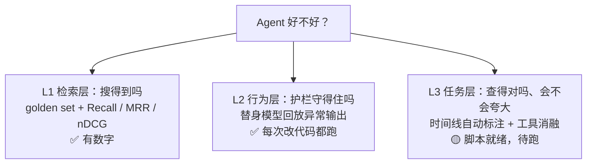

# 12 评测体系学习报告（附简历第三点改写）

> 依据：仓库代码、`评测/` 目录（00-09）和 `docs/benchmarks/retrieval-summary.json`，截至 2026-10-02。
> 用途：先把评测讲明白，再对照简历第三点逐句核对、改写。

## 📌 速览

- 评测分三层：**L1 测工具（搜得到吗）、L2 测护栏（守得住吗）、L3 测任务（查得对吗）**。
- L1 是项目早期为单次分诊做的检索评测，**有真实数字**；L2 是替身模型行为测试，**一直在跑**；L3 是项目改成对话 Agent 后新补的，**脚本就绪、还没跑**。
- 简历第三点现在有 4 处在仓库里找不到依据，按本文第 5 节改写后，每一句都能指到代码或文档。



## 1. 为什么要分层

只看检索指标会有两个盲区：

1. **搜到不等于查对。** 搜索工具召回了正确的 Issue，Agent 仍可能没去读关联 PR，或者把"有人提了 PR"说成"已经修复"。
2. **模型有随机性，护栏没有。** 引用白名单、调用预算这些规则是确定的，应该用确定的方式测，不该和模型效果混在一起。

所以按"能不能确定判断"拆开：确定的放 L1、L2，跑一次就够；含模型随机性的放 L3，重复多次报均值。这个思路来自 `评测/02-两类测试.md` 的"断言测试 vs 指标测试"。

## 2. L1 检索层：搜得到吗

### 2.1 评测集怎么来的

GitBugs 数据里，被判为重复的 Issue 带有 `duplicate_of` 字段，指向它重复的那条。把"重复的 Issue"当查询、`duplicate_of` 当标准答案，就得到一个现成的检索评测集（golden set）。

构建时修了三个坑（`eval/golden_set_builder.py`）：

| 坑 | 问题 | 修法 |
| --- | --- | --- |
| 答案不可达 | 34% 的标准答案根本不在索引里，检索永远不可能命中，指标被系统性低估 | 构建时用索引的 ID 全集校验，剔除不可达答案；全部不可达的查询整条丢弃 |
| 自命中 | 查询自己也在索引里，第一名往往是它自己 | 评测时多取一条，剔除查询自身后再截断（`eval/run_eval.py` 的 `_exclude_self`） |
| 家族泄漏 | 同一组重复问题 A→B 进调参集、B→A 进测试集 | 用并查集把互相重复的 Issue 连成"家族"，按家族整体划分 80/20 |

结果：13,104 条原始重复记录 → 8,599 条有效查询，测试集 1,726 条，日常用固定种子抽 200 条。

### 2.2 指标

| 指标 | 一句话含义 |
| --- | --- |
| Recall@K | 前 K 个结果里，命中了多少比例的标准答案 |
| MRR | 第一个命中排在第几位，取倒数后平均；越靠前越接近 1 |
| nDCG@10 | 前 10 名的整体排序质量，命中越靠前得分越高 |
| P50 / P95 | 一半 / 95% 的查询在多少秒内完成 |

### 2.3 已有数字（200 条抽样，种子 42，剔除自命中）

| 配置 | Recall@10 | Recall@30 | MRR | nDCG@10 |
| --- | --- | --- | --- | --- |
| 纯向量 | 0.3965 | 0.4835 | 0.2709 | 0.2886 |
| 纯 BM25 | 0.3337 | 0.4305 | 0.2492 | 0.2589 |
| 混合（RRF） | 0.4257 | 0.5394 | 0.2775 | 0.2974 |
| 混合 + 精排 | 0.3701 | — | 0.2292 | 0.2542 |

怎么解读：

- 混合比纯向量的 Recall@10 高约 3 个百分点，说明两路互补。
- **精排反而下降**：通用重排模型在这份语料上是负收益，要如实承认，不要当亮点。
- 精排配置只算 @5、@10，因为它最多只输出 10 条，和输出 30 条的配置比 @30 不公平。

### 2.4 局限

- 测的是**单条原文查询**，不是线上的"改写查询 + 原文"双路查询。
- 只能说明检索组件的召回能力，说明不了 Agent 最终答得对不对。
- 新同步的 GitHub 仓库没有标注，测不了。

## 3. L2 行为层：护栏守得住吗

### 3.1 什么是"替身模型"

测试时不调用真实大模型，而是用一个**按剧本回答的假模型**。剧本里可以故意写"坏输出"，然后断言程序的反应。测的是模型之外那层程序（Harness），不花钱、结果稳定，每次改代码都能跑。

### 3.2 现有用例举例（`tests/test_chat_runtime.py` 等）

| 剧本 | 断言 | 用例 |
| --- | --- | --- |
| 模型引用一个没读过的资料 | 程序把编造的引用丢掉 | `test_followup_reads_linked_pr_and_rejects_fake_citation` |
| 模型连续发起大量工具调用 | 到预算后停止，超出的调用返回失败 | `test_tool_and_model_budgets` |
| 模型重复调用同一个工具 | 只真正执行一次 | `test_repeated_tools_cached_errors_return_to_model` |
| 用户只说"解决了" | 不把某个 PR 记成"用户验证有效" | `test_unspecified_resolution_cannot_validate_guessed_pr` |
| 服务在提问等待时重启 | 恢复后能继续，答案不重复提交 | `test_question_restart_idempotence_and_resume` |

## 4. L3 任务层：查得对吗、会不会夸大

### 4.1 核心想法：用 GitHub 时间线做免费的客观标注

Agent 要回答"这个问题修了没有、怎么修的"，难点是没有标准答案。但 GitHub 自带客观事实：Issue 关没关、关联 PR 合没合并、PR 里有没有写 `Fixes #编号`。程序就能判定，不用人从零标。

| 类别 | 条件 | 测什么 |
| --- | --- | --- |
| 已修复（`fixed_merged`） | Issue 已关闭，且有已合并的 PR 用关闭关键词指向它 | Agent 能不能找到并引用这个 PR |
| 无修复（`no_fix`） | Issue 还开着，且没有任何关联 PR | Agent 会不会夸大成"已修复" |
| 证据不明确 | 其他情况 | 自动跳过 |

自动标注只是草稿，人工抽查后才算正式案例。

### 4.2 指标

| 指标 | 含义 | 方向 |
| --- | --- | --- |
| 关键证据召回 | 已修复案例中，Agent 是否真的读到了那个修复 PR | 越高越好 |
| 引用命中 | 回答是否把修复 PR 作为依据引用 | 越高越好 |
| 夸大率 | 无修复案例中，回答却说"已修复" | 越低越好 |
| 一致性 | 同一案例跑 3 次，结论是否一致 | 越高越好 |
| 成本 | 工具调用数、模型调用数、token、耗时 | 越低越好 |
| 裁判正确率（可选） | LLM 裁判对照事实判结论对错 | 越高越好 |

### 4.3 消融：同一份代码切换工具集

| 变体 | 可用工具 | 回答什么 |
| --- | --- | --- |
| `agent` | 全部 6 个 | 完整系统 |
| `no_pr_tools` | 去掉读 PR、搜 PR | 追查 PR 这一步值多少 |
| `search_only` | 只有搜索 | 近似传统 RAG 基线，回答"为什么要做 Agent" |

### 4.4 怎么跑

```bash
python -m eval.benchmarks.agent_tasks build --repository owner/repo --limit 40   # 自动标注草稿
# 人工抽查 eval/benchmarks/data/agent_cases.json，无误的改成 "status": "verified"
python -m eval.benchmarks.agent_tasks run --variant agent --label agent_v1
python -m eval.benchmarks.agent_tasks run --variant search_only --label rag_baseline
python -m eval.benchmarks.agent_tasks compare eval_results/agent_tasks_rag_baseline.json eval_results/agent_tasks_agent_v1.json
```

需要本机有效的 DeepSeek 密钥和 GitHub 访问（建议配置 `GITHUB_TOKEN`）。完整方案见 `评测/09-Agent任务评测方案.md`。

## 5. 简历第三点：核对与改写

### 5.1 原文

> **评测与质量保障**：基于 GitBugs 10.6 万条 Issue 检索库，构建 200 条检索查询＋100 条人工复核分诊样本，覆盖重复提交漏检、相似故障误合并、长日志干扰与低置信度重检索等场景；通过混合检索、粒度配置及反馈重写消融，验证历史问题召回与完整 Agent 分诊效果，结合逐轮 Trace 分析漏检补回、误判退化及延迟与调用成本。

### 5.2 逐句核对

| 原文说法 | 仓库里的依据 | 判断 |
| --- | --- | --- |
| 基于 GitBugs 10.6 万条 Issue 检索库 | 索引与 golden set 构建 | ✅ |
| 200 条检索查询 | 测试集固定种子抽 200 条 | ✅ |
| 100 条人工复核分诊样本 | 找不到；两个 benchmark 的案例文件都只有示例 | ❌ |
| 覆盖漏检、误合并、长日志、低置信度等场景 | 只有 `评测/01、02` 的设计，没有对应标注集 | ❌ |
| 混合检索消融 | 有向量 / BM25 / 混合 / 精排四组数字 | ✅ |
| 粒度配置消融 | 对照组需要的 chunk 粒度 BM25 还没实现（`评测/07` 步骤 C） | ❌ |
| 反馈重写消融 | retry benchmark 因模型余额不足没跑成（`评测/08`） | ❌ |
| 验证完整 Agent 分诊效果 | 端到端评测没有跑过 | ❌ |
| 逐轮 Trace 分析漏检补回、误判退化 | 评测只存汇总，不存逐条记录（`评测/08` 第 5 节） | ❌ |

面试官问"100 条样本怎么标的""粒度消融提升了多少""Trace 里看到了什么"，目前都答不上来。如果其中某项你本地确实做过、能拿出文件，可以保留那一项。

### 5.3 改写（按你的写法：加粗标题 + 针对问题 + 做法 + 加粗关键机制 + 作用）

**版本 A：现在就能用**（每句都有代码依据；L3 已实现但未出结果，被问到要如实说"还没跑完"）

> **分层评测与质量保障**：针对检索指标难以反映 Agent 调查质量的问题，构建检索、行为、任务三层评测；检索层基于 GitBugs 重复标注自建评测集，剔除不可达答案与自命中；行为层以**替身模型回放**越界引用、超预算等异常输出做离线回归；任务层基于 **Issue 时间线自动标注**修复 PR，通过工具集消融对比 RAG 基线，衡量证据召回、结论夸大与调用成本。

**版本 B：跑完 L3 之后**（把末尾换成真实数字）

> ……任务层基于 **Issue 时间线自动标注**修复 PR，通过工具集消融对比 RAG 基线，关键证据召回 __ → __、结论夸大率 __ → __。

改写说明：

- 标题从"评测与质量保障"改成"分层评测与质量保障"，一眼看出有体系。
- 去掉了所有没有依据的说法（人工复核样本、粒度消融、反馈重写消融、Trace 分析）。
- 三个亮点各占一句：评测集修坑、替身模型、时间线自动标注加消融。
- "对比 RAG 基线"顺带回答了"为什么要做 Agent"。

### 5.4 改了第三点之后，前面要同步改一句

第三点讲的是 Agent 调查质量，但项目简介和前两点只写了单次分诊，读起来会接不上。建议在项目简介末尾补一句：

> ……为维护者的问题归并和后续排查提供决策支持；**并扩展为可调用 Issue、PR 工具的对话调查 Agent，支持追踪关联修复与证据引用。**

## 6. 简历其他地方的风险提示

这些不是第三点，但面试官很可能顺着问：

| 位置 | 说法 | 风险 |
| --- | --- | --- |
| 技术标签 | Docker | 仓库里没有 Dockerfile |
| 专业技能 | 熟悉 Docker 部署与 CI/CD 流程 | 仓库里没有 CI 配置 |
| 专业技能 | 掌握 ChromaDB、Milvus 与 FAISS | 项目只用了 ChromaDB |
| 专业技能 | 熟悉……上下文压缩 | 项目没有自动压缩（见 `docs/11` 第五节），被问到要能讲方案 |
| 专业技能 | 熟练使用 LangChain、LangGraph | 上次面试官就是顺着"熟练"追问的，建议改成"在项目中使用" |
| 项目时间 | 2026.02 — 2026.04 | 公开仓库的提交记录持续到 2026.10，面试官点开 GitHub 可能会问 |

原则：简历上每一条都要能指到代码、文档或你能讲清楚的经历。

## 7. 面试口径

完整口语稿见 `docs/04c-面试问答手册-Agent专题.md` 的 Q6。最短版本：

> 我的评测分三层：检索层测搜不搜得到，行为层测护栏守不守得住，任务层测查不查得对。任务层的难点是没有标准答案，我用 GitHub 时间线做免费的客观标注，再切换工具集和 RAG 基线做对比。检索层有数字，任务层的框架搭好了，还没用真实模型跑完。

## ✅ 自测

1. 为什么检索指标高，不代表 Agent 答得好？
2. golden set 构建时修了哪三个坑？
3. 混合加精排为什么反而下降？面试时怎么说？
4. 什么是替身模型？它测的是模型还是程序？
5. L3 的"无修复"负样本为什么只能测夸大，不能测答对？
6. `search_only` 变体是用来回答什么问题的？

<details>
<summary>自测答案</summary>

1. 搜到正确的 Issue 后，Agent 还可能没读关联 PR、引用错资料，或者把"提了 PR"说成"已修复"。
2. 剔除不可达答案（34%）、剔除查询自命中、按重复家族划分防泄漏。
3. 通用重排模型不适配这份语料。如实说负收益，并说明保留了这个结果、后续考虑领域数据或调整候选规模。
4. 按剧本输出的假模型，可以故意给出坏输出；测的是模型之外的程序能不能挡住错误。
5. "没有关联 PR"不等于"真的没修"，可能有人修了但没关联，所以只能用来抓"无依据地说已修复"。
6. 近似传统 RAG 基线，和完整 Agent 对比，回答"为什么要做 Agent 而不是 RAG"。

</details>
