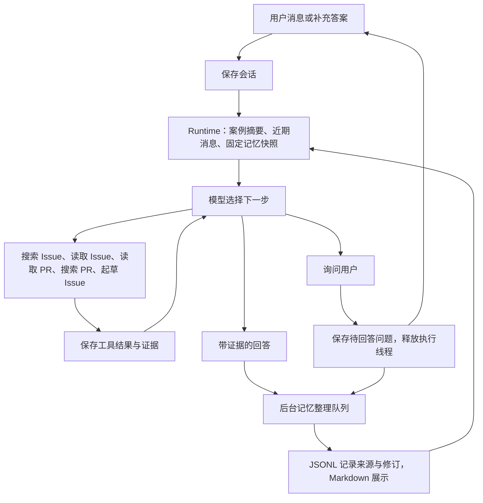

# 第一版调查 Runtime 与自动记忆

实施于 2026-09-30。沿用现有 Python 模型客户端、检索重排和草稿。长期记忆以本地 JSONL 为真实记录、Markdown 为可读文件。会话继续由原 ChatStore 保存。

## 调用关系

## 文件分工

- `src/chat/runtime.py`：六个工具、模型循环、参数检查、本轮结果复用、预算、暂停和引用校验。
- `src/chat/github_research.py`：读取 Issue 时间线、关联 PR、讨论和有限 diff。跨引用表示关联，相似 PR 表示候选，均不自动等于已修复。
- `src/chat/service.py`：模型客户端、完成回答、草稿生成和记忆快照。
- `src/chat/store.py`：会话、工具消息、焦点、待回答问题和答案幂等提交。
- `src/chat/memory_service.py`：适用记忆读取、顺序整理、来源校验、偏好和结果状态。
- `src/chat/memory.py`：记忆事件、任务与提炼结果、修订历史和删除保护。
- `frontend/src/components/ChatWorkspace.tsx`：对话内提问、自由输入、取消、调查过程、自动记忆查看与纠正。

## 一轮调查

用户追问解法时，提示词要求先读取当前 Issue 的评论和关联 PR；没有关联或证据不足，再搜索同仓库 PR。模型负责选择工具，程序限制仓库、读取长度与引用 ID。

每个用户轮次最多 6 次调查模型调用、10 次工具调用。草稿内部调用计入 6 次；后台记忆最多另用一次。最后一次调查调用用于总结。同一轮相同参数复用结果，下一轮允许刷新。工具失败返回模型继续判断。

`ask_user` 保存问题、选项和调用 ID 后结束执行线程。页面显示选项，普通输入也能回答。`POST /api/chat/sessions/{session_id}/answers` 将回答绑定为 ToolMessage，继续原调查，原话仍是用户消息。问题与幂等键同时校验；重复答案不重复恢复。取消或明确转向关闭旧问题。刷新与重启保留等待状态；执行中断的普通轮次允许重试。

## 自动沉淀

回答或暂停后提交一份独立快照：用户表达、实际工具证据、回答/提问、当前案例与已有记录。每轮评估，有新增价值才写入。纯偏好交流不强行建立案例，技术调查使用工具或提问时关联案例。

- 计划和假设保留为待验证。
- PR 等来源描述修复仅标为有资料支持。
- 用户明确反馈成功或失败，才记录已验证或已否定，引用用户原话。
- 明确长期偏好自动生效；一次性要求不升级为长期偏好。
- 推断偏好先是观察，至少两个独立会话的用户表达后供参考。
- 修订须指定既有记忆 ID，检查任务快照的版本；手动编辑优先，删除过的旧证据不重建。

模型提炼结果先保存到任务日志。重启或写入重试复用提炼结果；任务按会话和消息 ID 去重，新增经验使用稳定操作 ID。来源摘录独立保留，不依赖会话是否仍在。后台失败不改变已经显示的回答。

界面主要呈现当前案例摘要；调查过程、本轮参考记忆、来源与修订记录可展开查看。手动补充经验仍可使用。

## 当前范围与检查

第一版仅当前仓库，PR 按需读取，不做全量索引。时间线、评论和 diff 有界，标明截断或失败。PR 合并不代表已发布；来源宣称不等于用户验证。

离线回归覆盖工具协议、Issue→PR、提问/重启/恢复、重复提交、取消、预算、工具错误、仓库过滤、重排、草稿、自动偏好、失败修订、手动修改与删除保护、任务恢复。测试使用替身，不构成真实模型的检索质量评测。
