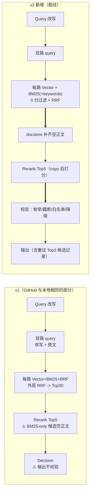
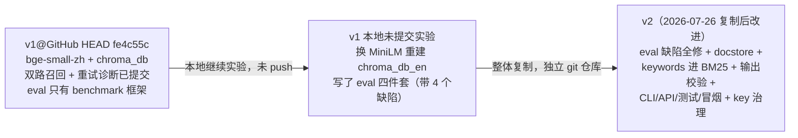

# 00 版本差异：v1（GitHub）vs v2（本地）

> 对比对象：
> - **v1@GitHub** = `github.com/Rinta13795/issue-rag-agent` HEAD（commit `fe4c55c`
>   "Add dual-query retrieval benchmark"）
> - **v1 本地工作区** = `~/Desktop/项目/RAG项目` 的未提交实验（介于两者之间，
>   部分改动没推上 GitHub——这层必须单独列，否则简历口径对不上）
> - **v2** = `~/Desktop/项目/RAG项目-v2`（2026-07-26 从 v1 本地复制后系统性改进，
>   git 独立仓库，全部已提交）
>
> ⚠️ 最重要的结论放最前：**你简历/八股里的几个关键说法与代码事实不符**，
> 详见第 5 节，面试前必须处理。

## 1. 四个核心维度的差异总表

| 维度 | v1@GitHub | v1 本地工作区（未提交） | v2 |
| --- | --- | --- | --- |
| **Embedding 模型** | `BAAI/bge-small-zh-v1.5`（512 维，**中文**模型） | `sentence-transformers/all-MiniLM-L6-v2`（384 维，英文） | 同 v1 本地：`all-MiniLM-L6-v2`（384 维） |
| **向量库** | ChromaDB，目录 `./chroma_db`（用中文模型建的旧索引） | ChromaDB，目录 `./chroma_db_en`（英文模型重建，1.8G） | 同 v1 本地：`./chroma_db_en`；新建 collection 显式声明 cosine 空间（旧索引是 l2 遗留） |
| **BM25 实现** | `rank-bm25` BM25Okapi，issue 粒度，pickle 持久化；返回含 0 分候选；keywords **不参与**检索 | 与 v1@GitHub 相同（未改） | 同库同粒度，但：① keywords 作为 extra_terms 追加进查询 token；② 过滤 0 分候选 |
| **检索流程** | Query 改写 → 双路 query（改写+原文）各跑 Vector+BM25+RRF → 外层 RRF → Rerank → Decision；**BM25-only 候选无正文** | 与 v1@GitHub 相同 | 在 v1 基础上：融合后 **docstore 补齐空正文候选**；Decision 输出加程序级校验（枚举/置信度截断/related_issues 白名单/无证据降级重试）；重试 prompt 携带上轮 Top-3 候选 |

补充维度：

| 维度 | v1@GitHub | v1 本地工作区 | v2 |
| --- | --- | --- | --- |
| 评估体系 | `eval/` 只有两个 benchmark 框架（retry_quality、dual_query），**没有** golden set 构建器、指标、评估 runner | 有未提交的 golden_set_builder/metrics/run_eval/report，但存在四个有效性问题（见下） | 修复后全部提交：可达性过滤、自命中剔除、family 隔离划分、nDCG IDCG 修复、公平截断点 |
| 实测指标 | **无任何可运行的正式评估** | 有两个不完整结果文件（vector/bm25），不可信 | 200 条抽样实测：vector recall@30=0.4835 / bm25 recall@30=0.4305（hybrid/rerank 待补跑） |
| 服务入口 | 只有 `run_agent()` 函数 | 相同 | + `main.py` CLI + `api.py` FastAPI |
| 测试 | 2 个测试文件 | 相同 | 6 个文件 32 个用例 |
| 其他工程 | `.env.example` 含真实 API key（已进 git 历史）；Reranker 原地改输入；每次 run_agent 重新构图 | 相同 | 占位符化；copy 后打分；图缓存；LLM timeout/重试 |

## 2. 关键差异的源码对照

### 2.1 Embedding 与向量库（v1@GitHub vs v2 的 config）

```python
# ===== v1@GitHub config.py =====
# Embedding 模型名称：本地 HuggingFace BGE 中文模型，不调用 API。
EMBED_MODEL = "BAAI/bge-small-zh-v1.5"
EMBED_DIM = 512
# ChromaDB 持久化目录：向量库本地保存路径。
CHROMA_PERSIST_DIR = "./chroma_db"

# ===== v2 config.py =====
# Embedding 模型名称：本地 HuggingFace 英文模型，不调用 API。
# 数据集全为英文 issue，改用英文 all-MiniLM-L6-v2。
EMBED_MODEL = "sentence-transformers/all-MiniLM-L6-v2"
EMBED_DIM = 384
# ChromaDB 持久化目录：英文索引重建到新目录，旧 zh 索引 ./chroma_db 保留可回滚。
CHROMA_PERSIST_DIR = "./chroma_db_en"
```

**含义**：GitHub 上的 v1 是"**中文 embedding 模型嵌英文 issue**"的版本——GitBugs
数据全是英文，bge-small-zh 的英文能力弱，这是当时的选型失误；本地实验换成英文
MiniLM 并重建索引到 `chroma_db_en`，**但这次换模型从未推上 GitHub**。任何人 clone
你的仓库看到的仍然是 bge-small-zh + chroma_db。

Reranker 三个版本一致，都是 `BAAI/bge-reranker-base`（这是 BGE 家族里唯一在 v2
仍然成立的部分）：

```python
# 三个版本相同
RERANKER_MODEL = "BAAI/bge-reranker-base"
```

### 2.2 BM25：v1 与 v2 的 search 对照

```python
# ===== v1@GitHub src/retrievers/bm25_retriever.py =====
def search(self, query: str, top_k: int = BM25_TOP_K) -> list[dict]:
    query_tokens = tokenize(query)
    scores = self.bm25.get_scores(query_tokens)
    top_indices = sorted(range(len(scores)), key=lambda i: scores[i], reverse=True)[:top_k]
    # 0 分候选也会返回；keywords 完全不参与
    return [{"id": self.ids[i], "score": float(scores[i])} for i in top_indices]

# ===== v2 src/retrievers/bm25_retriever.py =====
def search(self, query, top_k=BM25_TOP_K, extra_terms=None):
    query_tokens = tokenize(query)
    for term in extra_terms or []:              # v2 新增：keywords 追加进 token，
        if isinstance(term, str) and term.strip():   # 等效提升错误码/API 名的词频权重
            query_tokens.extend(tokenize(term))
    scores = self.bm25.get_scores(query_tokens)
    top_indices = sorted(range(len(scores)), key=lambda i: scores[i], reverse=True)[:top_k]
    return [{"id": self.ids[i], "score": float(scores[i])}
            for i in top_indices
            if float(scores[i]) > BM25_MIN_SCORE]    # v2 新增：过滤 0 分（无词命中）候选
```

### 2.3 检索流程：v2 新增的 docstore 补齐

v1（两个版本都是）的已知缺陷——BM25-only 候选没有正文：

```python
# v1 hybrid_retriever.py：只在 BM25 出现的 issue 没有 chunk 内容，
# 返回空 title/body/metadata 作为最小信息 —— Reranker/Decision 拿到的是空字符串
if issue_id not in issue_docs:
    issue_docs[issue_id] = {"id": issue_id, "title": "", "body": "", "metadata": {}}
```

v2 在融合排序后统一补齐（新增 `src/docstore.py`，106,655 条 id→{title, body 前
1200 字符}，72MB）：

```python
# v2 hybrid_retriever.py
def _hydrate(self, results: list[dict]) -> int:
    """只填空缺、不覆盖：向量路候选的 body 是与 query 最相关的 chunk。"""
    if not self.docstore:
        return 0                                  # docstore 缺失时退回 v1 行为
    for doc in results:
        record = self.docstore.get(str(doc["id"]))
        if record is None: continue
        if not str(doc.get("title", "")).strip() and record.get("title"):
            doc["title"] = record["title"]
        if not str(doc.get("body", "")).strip() and record.get("body"):
            doc["body"] = record["body"]
```

### 2.4 Decision 输出校验（v1 完全没有，v2 新增）

```python
# v1 nodes.py：只做类型兜底，枚举/范围/ID 真实性都不验证
decision = parsed.get("decision", "new")
related_issues = parsed.get("related_issues", [])
if not isinstance(related_issues, list):
    related_issues = []

# v2 nodes.py：程序级校验
if decision not in VALID_DECISIONS:               # 枚举
    decision = "new"; parsed["confidence"] = 0.0
confidence = min(max(confidence, 0.0), 1.0)       # 截断 [0,1]
candidate_ids = {str(d.get("id","")) for d in state["reranked_docs"]}
related_issues = [str(i) for i in related_issues if str(i) in candidate_ids]  # 白名单
if decision in ("duplicate", "similar") and not related_issues:
    decision = "new"; confidence = min(confidence, 0.4)   # 无证据降级并触发重试
```

## 3. 检索流程图对照（Mermaid）



## 4. eval 目录差异（决定"指标能不能说"）

| 文件 | v1@GitHub | v1 本地 | v2 |
| --- | --- | --- | --- |
| eval/benchmarks/（retry、dual_query 框架） | ✅（无 verified 案例，跑不了正式结果） | ✅ 同 | ✅ 同（仍缺 verified 案例） |
| eval/golden_set_builder.py | ❌ 不存在 | ✅ 未提交（有 4 个有效性问题：缺 normalize、随机划分泄漏、不剔自命中、不过滤不可达目标） | ✅ 已修复并提交（34% 无解 query 被清出：13,104→8,599） |
| eval/metrics.py | ❌ | ✅ 未提交（nDCG 的 IDCG 实现错误，命中 1 条即满分） | ✅ 已修复（IDCG 按 min(相关数, K) 计算）+ 回归测试 |
| eval/run_eval.py | ❌ | ✅ 未提交（不剔自命中；Rerank 结果算 recall@30 不公平） | ✅ 已修复（top_k+1 剔自身；Rerank 只算 @5/@10；固定 seed 抽样） |
| 可信实测结果 | **无** | **无**（两个不完整 JSON） | vector/bm25 两配置已有（200 条抽样），hybrid/rerank 待补跑 |

## 5. ⚠️ 简历口径 vs 代码事实（必须处理）

你的简历/八股口径逐条核对（来源：`八股/Issue_RAG_Agent_完整八股.md` 的开口模板
与 CLAUDE.md 的"面试一句话"）：

| 简历/八股说法 | 代码事实 | 判定与建议 |
| --- | --- | --- |
| "ChromaDB" | 三个版本都是 ChromaDB | ✅ 可以直说 |
| "BGE 向量化 / BGE-small-zh 向量化写 ChromaDB" | v1@GitHub 确实是 bge-small-zh——但那是**用中文模型嵌英文数据的错误版本**；v1 本地和 v2 已换 all-MiniLM-L6-v2（384 维），**不是 BGE** | ⚠️ 半真。两种改法：① 简历改成"Sentence-Transformers 向量化 + BGE-Reranker 精排"（reranker 确实是 BGE，这句完全真）；② 如果坚持写 BGE embedding，必须把 v2 换回 bge 系（如 bge-small-en-v1.5）并重建索引，否则面试官 clone 仓库/追问维度（你答 384 还是 512？）就穿帮 |
| "Recall@10 从纯向量 0.61 → 0.82（+21pp），Precision@5 0.34→0.66，nDCG@10 0.52→0.81" | **任何版本都不存在这组数字**。v1@GitHub 连评估 runner 都没有；v1 本地的评估链路有 4 个有效性问题且没跑完；v2 修复后的真实抽样实测：vector recall@10=0.3965、precision@5=0.074、nDCG@10=0.2886（200 条，自命中已剔除），hybrid 提升幅度尚未测出 | ❌ **必须删除或重测**。这组数字一旦被追问"怎么测的、测试集多大、怎么划分的"就无法自洽；precision@5 差了近一个数量级。正确姿势：补跑 v2 的 hybrid/hybrid_rerank 评估，用真实数字+真实方法论（可达性过滤/自命中剔除/family 划分——这套方法论本身比编的数字更加分） |
| "GitBugs 15万条" | 本地快照 106,714 条、8 个项目 | ⚠️ 改成"10万+"或精确说 106,714/8 个项目 |
| "双路并行召回" | 实现是**顺序调用**（先 vector 后 bm25；两条 query 也是顺序循环）；"双路"另有歧义：既指 vector+bm25，也指改写+原文两条 query | ⚠️ 说"双路召回"没问题，别说"并行"；被追问时明确"逻辑并行、实现串行，瓶颈在 BM25 单路" |
| "低置信度携带上轮失败结果反思重写" | ✅ 三个版本都有（v1 携带决策+诊断计数；v2 额外携带上轮 Top-3 候选） | ✅ 可以直说，v2 口径更完整 |
| "LangGraph 四节点 workflow" | ✅ 一致 | ✅ 注意主动说"条件工作流而非自主 Agent"更加分 |

**一句话总结**：简历里"ChromaDB"站得住；"BGE"只对 Reranker 站得住；那组
21pp 提升的指标**在任何版本的代码里都不存在**，是最大的翻车点，要么删掉，
要么把 v2 的评估补跑完换成真实数字。

## 6. 差异的形成过程（帮你讲"版本演进"故事）



如果要把 v2 推上 GitHub：v2 是全新 git 历史（2 个 commit），可作为新仓库推送，
或与旧仓库做一次 squash 合并；**推之前确认 `.env` 不在（已 gitignore）且旧仓库的
泄漏 key 已在 DeepSeek 平台作废**。
