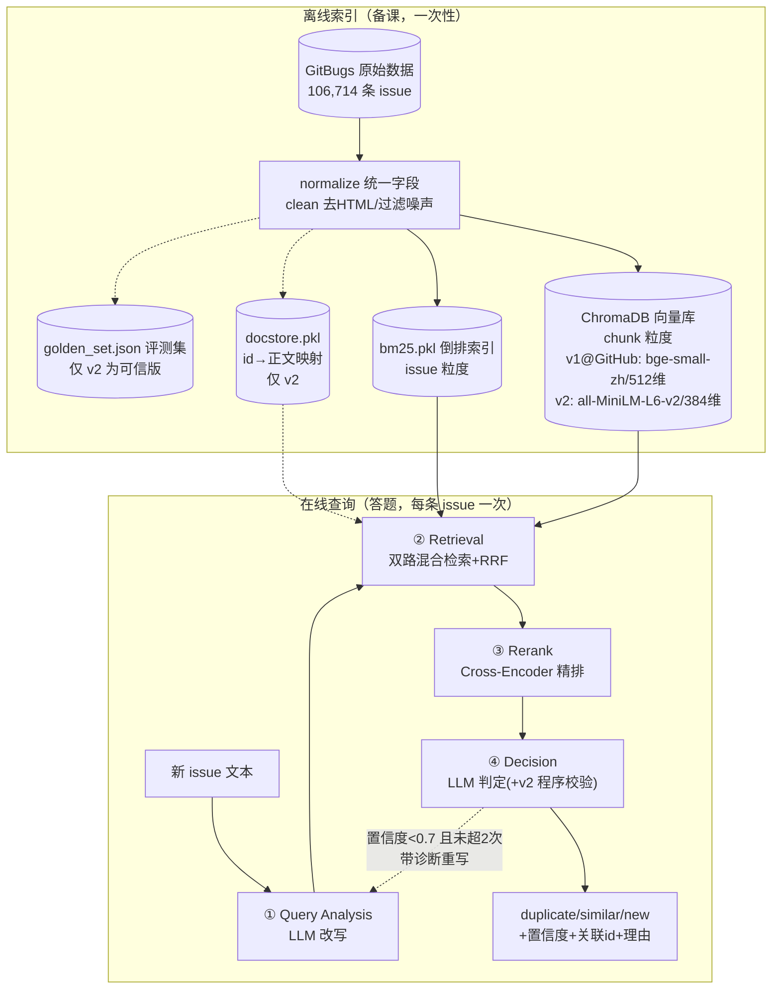
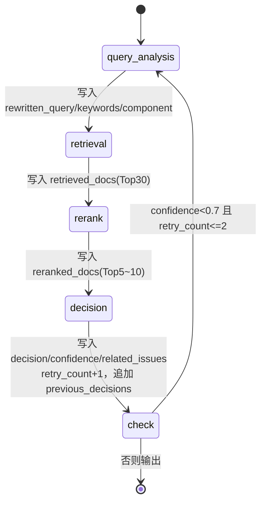
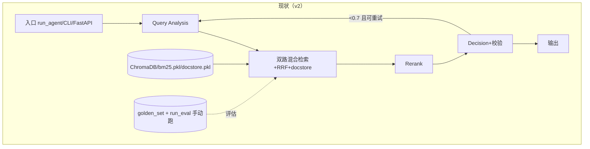
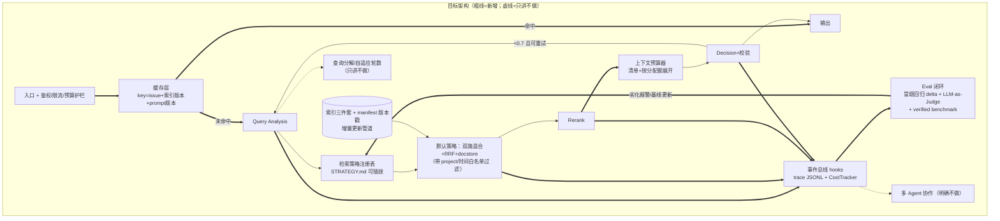

# 01 设计与架构：现状、空白与演进方向

> 阅读前提：只需要懂基础 Python。所有术语第一次出现时当场解释；所有源码
> 内嵌在文中，不需要打开代码库。
> 版本口径：v1 = GitHub 上的 `issue-rag-agent`；v2 = 本地改进版（差异详见
> `00-版本差异.md`）。两版共同的部分不区分标注，只在有差异处标 v1/v2。
> 参照材料：OpenHarness（HKUDS 的开源 agent 基础设施）与 claw-code
> （ultraworkers 的 agent 自治管理型 harness 展品）。官方 docs.claude.com 因
> 网络限制无法抓取，Skills/hooks 规范以 OpenHarness 中的等价实现代码为依据。

---

## 第一部分：这个项目在解决什么问题

**大白话**：你给一个大开源项目（比如 Firefox）报 bug，说"我打开 PDF 就崩了"。
维护者看到后的第一件事不是修，而是想："这问题是不是早有人报过？"如果报过，
正确处理是把你的 issue 标记为 duplicate（重复）关联到老 issue，而不是再修一遍。
问题在于：历史 issue 有十几万条，而且**同一个 bug 每个人的说法都不一样**——
有人贴堆栈，有人说"打不开文件"，有人只写一句"crashed again!!!"。人工找重复，
一条要花好几分钟，每天来几十条就是纯粹的体力消耗。

**为什么难**（三个层次，也正好对应系统的三段结构）：

1. **找得全**（召回问题）：重复的 issue 可能用词完全不同。"点登录就闪退" 和
   "crash on login button" 一个中文口语一个英文术语，靠关键词匹配找不到彼此；
   反过来，错误码 `MOZ_CRASH` 这种精确信号，靠"语义理解"又容易糊掉。所以需要
   **两种检索互补**：BM25（一种基于词频统计的经典关键词检索算法）抓精确信号，
   向量检索（把文本变成数字向量、按距离找相近语义）抓同义表达。
2. **排得准**（排序问题）：两路检索合起来有几十个"看起来相关"的候选，但"相关"
   不等于"重复"。需要一个更贵但更准的模型把真正像的排到前面——这就是
   Reranker（重排序器，逐对精读 query 和候选的模型）。
3. **判得明**（判定问题）："同一个模块、症状相似"可能根因完全不同。duplicate 的
   标准是"同一个根因、一次修复能同时解决"，这需要**比对推理**（读堆栈、比触发
   条件），还需要给出人能核查的理由——这是 LLM（大语言模型）决策阶段的活。

**如果没有这一整套会怎样**：只用关键词搜索 → 换个说法就漏；只用向量 → 错误码
区分不开、排序糊；只检索不判定 → 系统退化成搜索框，维护者还是要自己读完候选
做判断，没有压缩任何人工。

---

## 第二部分：现在是什么样（v1 与 v2）

### 2.1 整体架构：离线和在线两个世界

**大白话**：系统分两块。**离线**是"备课"——把十万条历史 issue 提前加工成
几份便于查找的资料（索引）；**在线**是"答题"——新 issue 来了，按固定流程查
资料、排序、下判断。备课很慢（几小时）但只做一次；答题每次几秒到几十秒。



**如果没有离线/在线分离会怎样**：每次查询现场处理十万条数据，一次查询几小时，
系统没有实用价值。

### 2.2 LangGraph 四节点状态机

**大白话**：LangGraph 是一个"流程图执行器"框架——你把每一步写成一个函数
（节点），声明谁连着谁（边），框架负责按图执行，并维护一个所有节点共享的
"公共笔记本"（State）。每个节点只往笔记本里写自己那几栏，别的栏不动。



条件边的真实代码（v1/v2 相同，`src/agent/graph.py`）：

```python
def should_retry(state: IssueState) -> str:
    # CONFIDENCE_THRESHOLD=0.7, MAX_RETRIES=2；retry_count 是 Decision 执行轮数
    if state["confidence"] < CONFIDENCE_THRESHOLD and state["retry_count"] <= MAX_RETRIES:
        return "retry"
    return "end"

graph.add_conditional_edges("decision", should_retry,
                            {"retry": "query_analysis", "end": END})
```

**如果没有状态机会怎样**：也能用普通函数+while 写，但"重试时哪些字段覆盖、
哪个字段追加"要手工管理，出 bug 的典型形态是重试轮读到上一轮的脏数据。

### 2.3 一条真实 issue 的完整生命周期

以 v2 冒烟测试真实跑过的输入为例（检索/精排/补齐是真实执行，LLM 因账户余额
为 0 用固定回复替身，标注在对应步骤）：

**输入**：
```text
Firefox crashes with MOZ_CRASH when opening a PDF file in a background tab.
Stack shows mozilla::dom::PDFViewer::Init. Started after updating to version 103.
```

**步骤 0 · 初始化**（输入：上面的字符串 → 输出：公共笔记本初始状态）

```python
{"raw_issue": "Firefox crashes with MOZ_CRASH ...", "retry_count": 0, "previous_decisions": []}
```

**步骤 1 · Query Analysis**（输入：raw_issue → 处理：LLM 提炼技术信号 →
输出：三个新字段。此例为冒烟替身的固定回复，格式与真实 LLM 输出一致）：

```json
{
  "rewritten_query": "Firefox crash MOZ_CRASH PDF background tab PDFViewer",
  "keywords": ["MOZ_CRASH", "PDFViewer", "crash", "PDF"],
  "component": null
}
```

解析有两层保险（真实代码，`src/agent/nodes.py`）：找不到合法 JSON 整体回退
`{"rewritten_query": 原文, "keywords": [], "component": None}`；解析成功但字段
为空/类型错时逐项清洗（空 query 回退原文、keywords 去重截 8 个）。

**步骤 2 · Retrieval**（输入：改写 query + 原文 + keywords → 处理：两条 query
各跑一遍"向量+BM25+RRF"，再外层 RRF 融合，v2 再用 docstore 补齐空正文 →
输出：Top-30 候选）。真实执行结果：**30 条候选，30 条都有正文证据**（v1 里
只被 BM25 召回的候选正文为空）。单条候选的形状：

```python
{"id": "firefox:1774245", "title": "Crash in [@ mozilla::dom::...]",
 "body": "（向量路=命中的 chunk 片段；BM25-only 路=docstore 补的正文前1200字符）",
 "metadata": {...}, "score": 0.0318}   # score 是 RRF 融合分，不是相似度
```

**步骤 3 · Rerank**（输入：query + 30 条候选 → 处理：每条组成
`(query, title+body 前 800 字符)` 文本对，bge-reranker-base 批量打分，降序取
Top-5，第 5/6 名分差<0.05 时最多扩到 10 → 输出：5 条带 `rerank_score` 的候选）。
真实执行：30 → 5 条。

**步骤 4 · Decision**（输入：query + keywords + 5 条候选（每条正文展示前 400
字符）→ 处理：LLM 输出 JSON，v2 再过程序校验 → 输出：最终判断）。此例替身
返回：

```json
{"decision": "new", "confidence": 0.9, "related_issues": [],
 "reasoning": "冒烟测试固定回复：验证链路，不代表真实判断"}
```

v2 校验规则（真实代码）：decision 必须 ∈ {duplicate, similar, new}；confidence
截断到 [0,1]；related_issues 只保留 5 条候选里真实存在的 id；duplicate/similar
却无合法 id → 降级 new 且 confidence≤0.4（故意低于 0.7，让系统在预算内自动重试）。

**步骤 5 · 出口**：confidence=0.9 ≥ 0.7 → 结束，返回五个字段。全程（不含 LLM）
实测 6.8 秒，其中依赖首次加载 4.3 秒只发生一次。

### 2.4 关键参数：含义、取值、为什么、调了会怎样

| 参数（当前值） | 大白话含义 | 为什么是这个值 | 调大 | 调小 |
| --- | --- | --- | --- | --- |
| CHUNK_SIZE=500 / OVERLAP=80 | 正文切片长度/相邻切片重叠 | 约一个段落；重叠 16% 保住边界句 | 单片语义混杂、向量糊 | 切太碎、上下文断裂 |
| VECTOR_TOP_K=30 | 向量路召回条数 | 召回层求"别漏"，精度交给后面 | 噪声挤进融合层 | 真答案进不了候选池 |
| VECTOR_CHUNK_FETCH_MULTIPLIER=2 | 先召 60 个切片再合并回 issue | 同一 issue 多个切片会占名额 | 更慢 | 合并后凑不满 30 条 |
| BM25_TOP_K=30 | 关键词路召回条数 | 与向量对等，融合才有"共识"可言 | 低分噪声 | 强匹配被截断 |
| RRF_K=60 | 融合公式 1/(k+排名) 的平滑常数 | Cormack 2009 论文经验值，免调参 | 排名差距被抹平 | 头名独大 |
| RERANK_TOP_K=5（动态最多10） | 精排后保留条数 | 控制 LLM 阅读量，防"迷失在中间" | LLM 读得多错得多 | 真答案排第6被砍（动态扩展兜底） |
| RERANK_DOC_MAX_CHARS=800 | 精排输入截断 | BERT 类模型约 512 token 上限 | 被底层不可控截断 | 证据不足打分失真 |
| CONFIDENCE_THRESHOLD=0.7 | 触发重试的置信度线 | 对齐判定 prompt 的分档语义 | 到处重试、延迟×3 | 差判断直接放行 |
| MAX_RETRIES=2 | 最多回炉次数 | 防死循环、封顶成本 | 长尾失控 | 重写机制虚设 |
| DECISION_BODY_PREVIEW_CHARS=400（v2；v1=200） | 判定时每候选展示的正文长度 | v2 有 docstore 补齐才敢加量 | prompt 费用↑ | 证据不足误判 new |
| DOCSTORE_BODY_MAX_CHARS=1200（仅 v2） | 正文库每条存多长 | 覆盖精排 800+判定 400 的需求 | 文件白白变大 | 精排吃不满 |

### 2.5 核心设计决策（是什么/为什么/备选/为什么没选/代价/没有会怎样）

#### 决策 A：粒度不对称——向量存 chunk，BM25 存整条 issue

**大白话**：向量最怕"长文平均成糊"，所以切碎存；BM25 是数词频的，文章越完整
统计越准，所以整条存。两路各用自己舒服的粒度，最后统一折算回"issue 排名"。

- **备选**：都用 chunk / 都用整条。**没选因为**：BM25 切碎会破坏词频和文档长度
  归一化的统计意义，还得处理同一 issue 的切片互相抢排名；向量用整条则长 issue
  的错误码信号被稀释。
- **代价**：向量路合并时"最高分切片代表整条 issue"，其余命中切片信息被丢。
- **真实代码**（向量路合并，v1/v2 相同）：

```python
chunk_results = self.vs.similarity_search_with_score(query, k=top_k * 2, filter=filter_dict)
issue_best = {}
for doc, distance in chunk_results:
    issue_id = doc.metadata.get("issue_id")
    score = 1 - float(distance)
    if issue_id not in issue_best or score > issue_best[issue_id]["score"]:
        issue_best[issue_id] = {"id": issue_id, "title": doc.metadata.get("title",""),
                                "body": doc.page_content, "score": score, ...}
```

- **没有会怎样**：要么关键词检索废掉一半（BM25 切碎），要么"打开 PDF 崩溃"这种
  短症状永远捞不出三千字长帖里的同款 bug（向量整条）。

#### 决策 B：RRF 融合而不是分数加权

**大白话**：BM25 的分没有上限（几十分很常见），向量相似度在 0-1 之间——这俩
数字不能直接加，就像不能把体重和身高加在一起排名。RRF（倒数排名融合）干脆不看
分数只看**名次**：每路第 n 名记 1/(60+n) 分，两路名次都好的自然靠前。

- **备选**：归一化后加权（要调权重 α，而当时连可信评测集都没有）；训练排序模型
  （要标注数据，冷启动没有）。**代价**：丢掉"这一路特别确定"的绝对分数信息——
  由下游 Cross-Encoder 重新打分兜回。
- **真实代码**（v1/v2 相同）：

```python
rrf_scores: dict[str, float] = defaultdict(float)
for rank, doc in enumerate(vector_results, start=1):
    rrf_scores[doc["id"]] += 1.0 / (RRF_K + rank)      # RRF_K = 60
for rank, doc in enumerate(bm25_results, start=1):
    rrf_scores[doc["id"]] += 1.0 / (RRF_K + rank)
ranked_ids = sorted(rrf_scores, key=lambda i: -rrf_scores[i])[:top_k]
```

- **举例**：`firefox:1774245` 在向量路排第 2（得 1/62）、BM25 路排第 5（得
  1/65），合计 0.0315，超过只在单路排第 1 的候选（1/61≈0.0164）——"两路共识"
  胜出。**没有会怎样**：要么被 BM25 的大分数单边碾压，要么调 α 调到怀疑人生。

#### 决策 C：两阶段——便宜模型海选，贵模型精审

**大白话**：能同时看 query 和候选每个词的模型（Cross-Encoder）最准，但一对
一对算，十万条算不起；能提前把文档算成向量存起来的模型（双塔/Bi-Encoder）快，
但两边互相看不见，精度有天花板。所以：快模型把 10 万压到 30，准模型只算 30 对。

- **备选**：只用召回分排序（RRF 分是名次共识不是相关性，直接取 Top-5 误伤高）；
  让 LLM 从 30 条里自己挑（贵一个量级且长上下文不可靠）。**代价**：CPU 上 30 对
  约 1-3 秒；输入截 800 字符，后段证据看不见。
- **没有会怎样**：LLM 面对 30 条候选，prompt 超长、真答案淹没在中间（业界叫
  Lost in the Middle——模型对长输入中段的注意力显著下降），判定质量和费用同时
  恶化。

#### 决策 D：条件边反思重写——低置信度不是终点而是重试信号

**大白话**：第一轮判断没把握时，系统不硬着头皮输出，而是带着"上一轮发生了什么"
回到改写步骤再来一遍——像考试时发现答案不确定，回头重新审题。

- **v1 携带**：上轮 query/keywords/判断/置信度 + 检索诊断（候选数、缺证据数、
  最高分、前两名分差）。**v2 额外携带**：上轮 Top-3 候选的 id/标题/分数——
  模型看到"上轮实际检索回了什么"，才能决定该换方向还是加细节。
- **真实 prompt 片段**（`query_analysis_retry.md`，v1/v2 共有的部分）：

```text
不要把低置信度直接等同于"召回不准"，也不要把上次 reasoning 当作事实。
- 没有候选时，适当放宽 query；
- 候选较多且前两名分差很小时，补充能区分候选的错误码、API、触发动作或对象。
```

- **备选**：固定跑 3 轮取最好（浪费：多数案例一轮就够）；不重试（低质量判断
  直接出门）。**代价**：最坏 3 整轮 = 3 倍延迟和 LLM 费用；重试是整轮重跑，
  没有增量优化。**没有会怎样**：改写偶发翻车（漏了关键错误码）的案例没有任何
  自救机会，直接输出一个 confidence 0.3 的垃圾结论。

#### 决策 E：chunk 策略——title / error_log / body 三分

**大白话**：一条 issue 里其实混着三种"材质"：标题是人写的摘要，堆栈是机器
输出的精确指纹，正文是自由发挥的描述。三种材质的"语义分布"完全不同，混在一个
向量里互相污染，所以入库前用正则把堆栈切出来单独存。

- **真实代码**（错误特征识别，v1/v2 相同）：

```python
TRACEBACK_PATTERN = r"Traceback \(most recent call last\):"
ERROR_MESSAGE_PATTERN = r"\b(?:[A-Za-z_][A-Za-z0-9_]*Error|Error):"
STACK_LINE_PATTERN = r"^\s*at\s+\S+\.(?:java|py|tsx|ts|js):\d+"
# 命中即从第一个匹配位置截到文末，作为 error_log chunk；剩余 body 按 500/80 递归切
```

- **备选**：整条一个向量（长帖糊掉）；固定长度硬切（把堆栈拦腰切断，两半都匹配
  不上）。**代价**：正则只认三种格式，Rust/Go panic 识别不到（降级进 body，不丢
  数据只丢加成）；错误段在正文中间时会把后文一起卷进去。
- **没有会怎样**：`MOZ_CRASH` 这类指纹被三千字描述稀释，最强的查重信号失效。

---

## 第三部分：现在缺什么（诚实盘点）

**先说定性结论：它现在是一条「检索管线」，还不是一个「可运行的系统」。**
"管线"指数据流从入到出是通的、每一环有设计有测试；"系统"要求它能被真实用户
持续使用——有服务形态、有账号和预算、有监控、有数据更新、有质量闭环。逐条空白：

| # | 空白 | 现状证据 | 缺了的后果 |
| --- | --- | --- | --- |
| 1 | **LLM 当前不可用** | DeepSeek 余额 0（实测 402）；旧 key 泄漏进 git 历史待作废 | 判定环节全线停摆，只有检索层能跑；端到端任何验证做不了 |
| 2 | **端到端质量未知** | 三分类无人工标注测试集；检索层也只有 vector/bm25 两配置实测（hybrid/rerank 中断待补） | 说不出"系统判对率多少"；简历里那组 21pp 指标无法自证（见 00 文档） |
| 3 | **时间穿越** | created_at 不在向量库 metadata，评测/线上都在检索"未来"的 issue | 指标偏乐观；真实上线（只能查历史）后表现必然低于评测 |
| 4 | **无增量索引** | 新 issue 只能全量重建（数小时） | 上线第二天索引就过期；无法跟进活跃仓库 |
| 5 | **无可观测** | 只有 loguru 文本日志；无各阶段耗时/token/成本的结构化埋点 | 延迟高了不知道怪谁；成本失控无感知；badcase 无法回放 |
| 6 | **无权限与安全边界** | FastAPI 无鉴权无限流；prompt 注入只有提示词级声明；BM25 慢查询能占死 worker | 公网一挂就是被刷余额+被注入+被打挂三连 |
| 7 | **无缓存与幂等** | 同一 issue 重复提交=全流程重跑重付费；索引重建不清旧 collection（v1 遗留行为） | 白花钱白等待；重复建库产生脏数据 |
| 8 | **评估未闭环** | golden set 已可信（v2），但评估靠手跑；两个 benchmark 缺 verified 案例跑不出结论；无 CI 回归 | 改一行 prompt 不知道整体变好变坏；改进全靠感觉 |
| 9 | **上下文无预算管理** | 候选正文按固定字符数硬截（800/400），不看 token 也不看信息量 | 长候选的关键证据被截掉；prompt 费用不可预测 |
| 10 | **配置/复现薄弱** | 无 lockfile/Docker/CI；HF 数据源默认指向不存在的数据集全靠本地 fallback | 换台机器跑不起来；"可复现"仅限自己这台 Mac |

---

## 第四部分：可以加什么（从 OpenHarness / claw-code 提炼，v1/v2 通用；
凡标注"依赖 v2"的，v1 需先合并 v2 的对应修复）

> 参照系简介（一句话）：**OpenHarness** 是 HKUDS 开源的轻量 agent 基础设施
> （agent loop、43 个工具、SKILL.md 按需加载、hooks、权限、记忆、成本追踪）；
> **claw-code** 是 ultraworkers 的"agent 自治管理"示范仓库——人只在 Discord 下
> 指令，多个 agent 自主计划/执行/验证/回归，其 docs/ 里留存了大量
> `verification-map`（验证映射：改动前先写"要验证什么、证据是什么"的文档）。

### 4.1 可观测：hooks 式阶段埋点 + 成本追踪 —— 【必加】

- **一句话结论**：给四个节点前后挂统一的事件钩子，每轮产出一条结构化 trace
  （各阶段耗时/候选数/token/成本），落 JSONL 可回放。
- **解决我的什么问题**：空白 5（延迟不知怪谁、成本无感知、badcase 无法回放）。
  实测已经证明需要：BM25 p95=49 秒这个结论是靠评估脚本才发现的，线上没有埋点
  就是黑盒。
- **参照怎么做的**：OpenHarness 把"生命周期事件"定义成枚举，任何逻辑都能订阅
  （`openharness/src/openharness/hooks/events.py`，完整源码）：

```python
class HookEvent(str, Enum):
    """Events that can trigger hooks."""
    SESSION_START = "session_start"
    SESSION_END = "session_end"
    PRE_COMPACT = "pre_compact"
    POST_COMPACT = "post_compact"
    PRE_TOOL_USE = "pre_tool_use"
    POST_TOOL_USE = "post_tool_use"
    USER_PROMPT_SUBMIT = "user_prompt_submit"
    NOTIFICATION = "notification"
    STOP = "stop"
    SUBAGENT_STOP = "subagent_stop"
```

  成本追踪是一个极简的累加器（`engine/cost_tracker.py`，完整源码）：

```python
class CostTracker:
    """Accumulate usage over the lifetime of a session."""
    def __init__(self) -> None:
        self._usage = UsageSnapshot()
    def add(self, usage: UsageSnapshot) -> None:
        self._usage = UsageSnapshot(
            input_tokens=self._usage.input_tokens + usage.input_tokens,
            output_tokens=self._usage.output_tokens + usage.output_tokens,
        )
```

- **我该怎么设计**：定义本项目的事件枚举——`PRE/POST_QUERY_ANALYSIS`、
  `PRE/POST_RETRIEVAL`（细分 vector/bm25 两个子事件）、`PRE/POST_RERANK`、
  `PRE/POST_DECISION`、`RETRY_TRIGGERED`、`RUN_END`。每个节点入口/出口发事件，
  事件携带 {轮次, 耗时, 候选数, top_score, token 用量}。一个 TraceCollector 订阅
  全部事件，run 结束时写一条 JSONL（含最终判断），另配一个 CostTracker 订阅
  LLM 相关事件累计 token。**关键取舍**：不引消息队列不引 OpenTelemetry，就是
  进程内回调+追加写文件，与 LangGraph 无侵入（在节点函数里手动发事件即可）。
- **新增模块与交互**：`src/observability/events.py`（枚举+dispatcher）、
  `src/observability/trace.py`（collector）；`nodes.py` 四个节点各加 2 行发事件；
  `run_agent` 结束时 flush。评估脚本改读 trace 而不是自己计时（消灭两套计时）。
- **工作量预估**：1-2 天（含把现有日志点迁到事件上）。
- **优先级**：【必加】——它是后面 Eval 闭环和延迟优化的地基。

### 4.2 Eval 闭环：回归测试 + LLM-as-a-Judge —— 【必加】

- **一句话结论**：把"golden set 评估"从手跑脚本升级为"每次改动自动跑小集合、
  出对比报告、劣化即报警"的闭环，判定层用 LLM 当裁判补上三分类评估。
- **解决我的什么问题**：空白 2 和 8——改 prompt/参数全靠感觉；三分类质量说不出
  数字。这是 00 文档里"简历指标无法自证"问题的唯一根治方式。
- **参照怎么做的**：claw-code 的开发文化是"**先写验证映射，再动手**"——每个
  目标（G002、G003…）都有一份 `docs/gXXX-*-verification-map.md`，规定改什么、
  怎么验证、证据长什么样。其安全目标验证图的真实开头（节选）：

```text
# G002 alpha security map and verification plan
- Worker ownership: worker-1 owns minimal implementation changes for
  workspace/path enforcement. worker-4 owns this repository map, integration
  verification plan, changed-file/commit report, and exact verification evidence.
- rust/crates/runtime/src/permissions.rs
  Existing tests cover read-only denial, workspace-write escalation, prompt
  approvals/denials, danger-full-access allowance, override recording...
```

  要点不是抄它的多 agent 分工，而是抄**"任何改动都必须预先声明验证证据"**：
  它的 PARITY.md 就是一张巨大的行为对照回归清单。
- **我该怎么设计**（三层）：
  ① **检索回归**：从 test set 固定抽 50 条做"冒烟评测集"，`make eval-smoke`
  跑 4 配置出与上次结果的 delta 表（我已有 run_eval + `_meta`，缺的只是
  "存基线+算 delta+阈值报警"三小步）；
  ② **判定评估**：人工标 150-300 条三分类（duplicate_of 只能提供 duplicate
  正例，similar/new 边界必须人标）；在此之上引入 LLM-as-a-Judge（用一个强模型
  按 rubric 给系统输出打分：判断类别是否与人工标注一致、reasoning 是否引用了
  真实候选特征）——裁判模型只做"对照打分"不做"自由评价"，并抽 10% 人工复核
  裁判本身；
  ③ **benchmark 激活**：给 retry_quality / dual_query 各标 20-30 条 verified
  案例（两个框架我已写好，卡在案例数据上）。
- **新增模块与交互**：`eval/regression.py`（基线存取+delta+阈值）、
  `eval/judge.py`（裁判 prompt+打分器）、`eval/data/labeled_300.json`（人工标注）；
  与 4.1 的 trace 打通（badcase 直接带全链路现场）。
- **工作量预估**：回归 1 天；标注 2-3 天（人力为主）；judge 2 天。
- **优先级**：【必加】——v2 的教训（34% 无解评测集）已经证明：没有可信评估，
  一切优化都是自我感觉。

### 4.3 检索策略 Skill 化（可插拔）—— 【建议加】

- **一句话结论**：把"一种检索策略"收敛成一个带元数据的声明式包（类似
  SKILL.md），运行时按需加载，新策略=加一个文件而不是改流程代码。
- **解决我的什么问题**：现在换检索策略（如"只用向量"、"加时间过滤的检索"、
  "跨项目检索"）要改 `nodes.py`/`hybrid_retriever.py` 硬代码；消融实验（4.2 的
  五组开关）也需要"可切换策略"的机制支撑，否则每组对照都在改源码。
- **参照怎么做的**：OpenHarness 的技能就是"目录 + SKILL.md（YAML frontmatter
  声明 name/description）+ 按需加载"，注册时只读元数据、用到才载入正文
  （`skills/types.py` 真实源码）：

```python
@dataclass(frozen=True)
class SkillDefinition:
    """A loaded skill."""
    name: str
    description: str
    content: str
    source: str
    path: str | None = None
    user_invocable: bool = True
    disable_model_invocation: bool = False
    model: str | None = None
```

  加载器按 `<root>/<skill-dir>/SKILL.md` 发现技能、解析 frontmatter 拿
  name/description（`loader.py`，节选自 grep 到的真实函数清单：
  `load_skill_registry` / `discover_project_skill_dirs` / `load_skills_from_dirs`
  / `_parse_skill_frontmatter`）。这套约定与 Claude Code 的 Agent Skills 公开
  格式一致（官方文档因网络限制未抓取，以此实现为准）。
- **我该怎么设计**：定义 `retrieval_strategies/` 目录，每个策略一个
  `STRATEGY.md`（frontmatter：name、description、适用条件）+ 一个同名 Python
  入口（实现统一接口 `search(query_bundle, top_k) -> candidates`）。现有
  hybrid 双路是默认策略；"vector_only""bm25_only""hybrid_no_rewrite" 作为
  首批插件（它们已存在于 run_eval，只是没插件化）。Retrieval 节点从"硬调
  HybridRetriever"改为"从注册表取当前策略"。我的 prompt 已经是"md +
  frontmatter"管理（`_load_prompt` 剥 frontmatter），这套约定是自然延伸。
- **新增模块与交互**：`src/strategies/registry.py` + `retrieval_strategies/*`；
  改动点只有 retrieval 节点取策略的一行 + 评估脚本按策略名遍历。
- **工作量预估**：2 天。
- **优先级**：【建议加】——对消融和实验迭代是杠杆，但不是当前质量瓶颈。

### 4.4 上下文工程：证据预算与清单（manifest）—— 【建议加】

- **一句话结论**：把"每候选硬截 400 字符"升级为"全局 token 预算 + 按相关度
  分配 + 先给清单再给正文"。
- **解决我的什么问题**：空白 9。现在 5 条候选无差别各 400 字符：第 1 名（rerank
  0.95）和第 5 名（0.31）拿到同样的展示额度，而真正需要细看的是前者。
- **参照怎么做的**：OpenHarness 的记忆注入是"先渲染紧凑清单，选择器挑中的才
  展开"（`memory/relevance.py` 真实源码，节选）：

```python
@dataclass(frozen=True)
class RelevantMemory:
    """A memory selected for prompt injection."""
    header: MemoryHeader
    freshness: str = ""

def build_memory_manifest(headers: Iterable[MemoryHeader]) -> str:
    """Render a compact manifest for selector prompts and diagnostics."""
    lines: list[str] = []
    for header in headers:
        bits = [f"[{header.memory_type or 'memory'}]",
                header.relative_path or header.path.name,
                f"({memory_age_label(header.modified_at)})"]
        if header.description:
            bits.append(f"- {header.description}")
        lines.append(" ".join(bits))
```

- **我该怎么设计**：Decision prompt 分两段——第一段是 5-10 条候选的**清单**
  （id/标题/rerank 分/一行摘要，每条 ~30 token）；第二段只对 Top-3（或
  rerank 分超阈值的）展开正文，展开额度按分数比例分（总预算如 2000 token）。
  重试轮的"上轮 Top 候选"同样走清单格式（v2 已经做了雏形：id+title+分数）。
- **新增模块与交互**：`src/agent/context_budget.py`（预算分配器）；
  `_format_candidates` 改造为调用它；与 4.1 打通记录"实际用了多少 token"。
- **工作量预估**：1-2 天。
- **优先级**：【建议加】——省钱且预期提升判定质量，但要靠 4.2 的评估闭环验证。

### 4.5 权限与安全边界（Governance）—— 【建议加，轻量版】

- **一句话结论**：三件套——API key 鉴权+限流；检索范围白名单（project/时间）；
  注入防护从"提示词声明"升级为"结构化隔离+输出白名单（已有）+审计日志"。
- **解决我的什么问题**：空白 6。此外 00 文档里的教训（真实 key 进 git 历史）
  说明凭据治理不是假想威胁。
- **参照怎么做的**：OpenHarness 有一层**无论什么模式都拒绝**的敏感路径硬名单
  （`permissions/checker.py` 真实源码，节选）：

```python
# Paths that are always denied regardless of permission mode or user config.
# These protect high-value credential and key material from LLM-directed access
# (including via prompt injection).
SENSITIVE_PATH_PATTERNS: tuple[str, ...] = (
    "*/.ssh/*", "*/.aws/credentials", "*/.config/gcloud/*",
    "*/.gnupg/*", "*/.kube/config", ...)

@dataclass(frozen=True)
class PermissionDecision:
    allowed: bool
    requires_confirmation: bool = False

class PermissionMode(str, Enum):
    DEFAULT = "default"; PLAN = "plan"; FULL_AUTO = "full_auto"
```

  可迁移的思想：**分级模式 + 硬底线名单 + 每次调用产出一个可审计的
  Decision 对象**。
- **我该怎么设计**：① api.py 加 API key 头校验 + 简单令牌桶限流 + 单日 LLM
  token 预算（超了直接返回"检索候选但不判定"的降级响应）；② 检索请求带
  `allowed_projects` 白名单，Chroma filter 和 BM25 后过滤都强制执行——这就是
  我版本的"硬底线名单"；③ 候选正文进 prompt 前用定界符包裹并转义定界符本身，
  配 5-10 条注入对抗样例做回归（挂进 4.2）。
- **新增模块与交互**：`src/governance/auth.py`、`budget.py`、`filters.py`；
  api.py 中间件挂接；trace 里记 PermissionDecision。
- **工作量预估**：2-3 天。
- **优先级**：【建议加】——不公开部署可以缓，但预算护栏建议提前（防跑评估
  时把余额烧穿）。

### 4.6 检索 Agent 化：查询分解、自适应轮数 —— 【只讲不做】

- **一句话结论**：让 LLM 决定"检索几轮、每轮查什么"（查询分解成多个子查询、
  按结果质量自适应加轮）——方向存在，但现在不做。
- **解决我的什么问题**：理论上解决"一条 issue 混多个问题"和"一轮检索不够"的
  长尾。但我的数据里多问题 issue 占比未知（没有测量），先测量再决定。
- **参照**：OpenHarness 的 agent loop（流式工具调用循环+并行工具执行）就是
  为这种"模型决定下一步"设计的基础设施；claw-code 更是整个仓库交给 agent 循环
  管理。**但**我的场景是固定目标的分类任务，v2 的条件边重试已经是"最小可控
  agent 化"（模型只决定"要不要再来一轮"，且有硬上限）。
- **为什么只讲不做**：① 收益未证实（先靠 4.2 量化"重试救回率"，retry benchmark
  框架就是干这个的）；② 成本立刻翻倍且长尾不可控；③ 可解释性下降，分诊场景
  维护者要的是稳定行为。**面试时这样讲**："我刻意把自主性限制在一条条件边上，
  因为在有真实评估之前，增加自主性只是增加方差。"
- **工作量预估**（若未来做）：查询分解 3-4 天 + 评估 2 天。

### 4.7 缓存与幂等 —— 【建议加】

- **一句话结论**：三层缓存（归一化 query→最终结果；候选集→rerank 分；LLM
  请求→响应）+ 建库幂等（重建先清旧 collection，docstore/golden set 带版本戳）。
- **解决我的什么问题**：空白 7。重复提交同一 issue（真实场景常见：用户连点、
  同一 bug 多渠道转发）现在=全流程重付费；v1 有"重建不清空旧 collection"的
  真实坑（README 自己记录了）。
- **参照怎么做的**：这条不需要抄参照系的代码——OpenHarness 的做法是把会话
  usage 累加成可查询状态（见 4.1 的 CostTracker），缓存命中率就该进同一个
  telemetry；claw-code 的启示是幂等靠"每次产物带可验证的版本标识"
  （其 progress/verification 文档都带 goal id 和 commit 锚点）。
- **我该怎么设计**：`cache_key = sha256(normalize(issue_text) + 索引版本号 +
  prompt 版本号)`——索引或 prompt 一变，缓存自动失效；结果缓存存 SQLite
  （单机够用）；LLM 层缓存只对 temperature=0.1 的确定性场景开。建库脚本开头
  `collection 存在则 drop 重建`，产物写入 `manifest.json`（构建时间、数据快照
  hash、模型名）。
- **新增模块与交互**：`src/cache.py`；`run_agent` 入口查缓存；`scripts/` 建库
  脚本加 manifest；trace 记命中率。
- **工作量预估**：2 天。
- **优先级**：【建议加】。

### 4.8 多 Agent 协作 / Swarm —— 【明确不做】

OpenHarness 有 swarm/coordinator（多 agent 协作基础设施），claw-code 干脆是
多 worker 自治仓库。**不做的理由**：我的任务是单条 issue 的固定流水线分类，
没有可并行的子目标分工；引入多 agent 只会把"BM25 慢"变成"BM25 慢+协调开销+
不可复现"。这条写出来是为了面试时能答"为什么不做多 agent"：**先有并行的活，
才有并行的工人**。

---

## 第五部分：目标架构（现状 vs 加入建议后）





## 第六部分：结论——如果只加三样

1. **可观测埋点（4.1）**：它把系统从黑盒变成可测量对象，是另外两样的地基；
   一两天工作量，性价比最高。
2. **Eval 闭环（4.2）**：这个项目已经用"34% 无解评测集"付过一次学费——
   没有闭环评估，后续所有投入（换模型、改 prompt、调参数）都无法证明有效，
   简历上的数字也永远立不住。
3. **缓存与幂等 + 预算护栏（4.7 + 4.5 的预算部分）**：在 LLM 账户充值后立刻
   生效的省钱阀门，也是敢把评估跑大、敢公开 demo 的前提。

不选 Skill 化和上下文预算进前三的原因：它们提升的是**迭代速度和质量上限**，
而当前的瓶颈是**看不见（无观测）和测不出（无闭环）**——先解决"知道自己在
哪"，再解决"跑得更快"。
