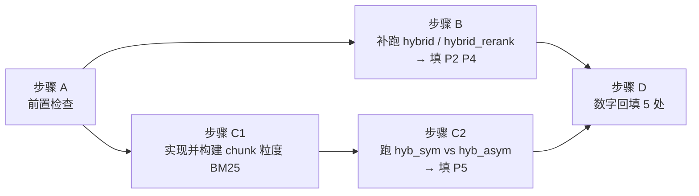

# 07 待跑清单：把简历的占位符填上

> 目标：填上简历"评估与消融"条的空位——Recall@10 \_\_→\_\_、nDCG@10
> \_\_→\_\_、粒度不对称 +\_\_pp。其中两个起点已实测（vector_only：
> recall@10=0.3965、ndcg@10=0.2886），**真正待跑 3 个数**：两个终点 + 粒度
> 贡献。全部为检索层任务（确定性，各跑一次，**不需要 LLM、不花 API 费用**）。

## 执行顺序与依赖



B 与 C 相互独立可并行；D 必须最后。

## 步骤 A：前置检查（~2 分钟）

```bash
cd ~/Desktop/项目/RAG项目-v2
python -m pytest tests/ -q                      # 32 用例应全过
ls -la chroma_db_en bm25.pkl docstore.pkl eval/data/golden_set.json
```

确认四份资产在位。⚠️ 期间**禁止重建 Chroma 索引**（HNSW 构建有随机性，
重建即断代，见 评测/00 与 04）。

## 步骤 B：补跑 hybrid / hybrid_rerank → 填 P2、P4（~40-60 分钟，CPU）

代码已就绪（run_eval 现有能力），直接跑：

```bash
HF_HUB_OFFLINE=1 python -m eval.run_eval --limit 200 --configs hybrid hybrid_rerank
```

- 耗时构成：hybrid ≈ 每条一次 BM25 全库打分（p50 2.9s）×200 ≈ 15-25 分钟；
  hybrid_rerank 另加 Cross-Encoder 30 对/条 ≈ 再 20-30 分钟。
- 取值：`eval_results/hybrid_rerank.json` 的 `recall@10` → **P2**、
  `ndcg@10` → **P4**（`_meta` 里核对 evaluated_queries=200、
  self_hit_excluded=true）。
- 顺手记录 `eval_results/hybrid.json`（消融链步骤③的现成对照点）。

## 步骤 C1：实现并构建 chunk 粒度 BM25 索引（实现 0.5-1 天；构建 ~15-40 分钟）

唯一需要写代码的一步。按 评测/05-实现规格 的 `suite/chunk_bm25.py` 规格实现：

```text
build_chunk_bm25(issues, out_path="bm25_chunk.pkl")
  # 语料 = chunk_issue() 输出的每个 chunk 的 page_content 经 tokenize
  # 持久化 {"bm25": BM25Okapi, "chunk_issue_ids": [chunk下标 -> issue_id]}
search_chunk_bm25(index, query, top_k)
  # get_scores -> chunk 排名 -> 每 issue 取最高分 chunk -> issue 级 Top-K
```

构建耗时估计：约 30 万 chunk 的 jieba 分词 + BM25Okapi 建库，CPU 15-40 分钟
（一次性）。构建输入必须与建 Chroma 同一条链路：
`clean([normalize(x) for x in load_data()])` → `chunk_issue()`。

## 步骤 C2：跑对称 vs 不对称对照 → 填 P5（~30-50 分钟，CPU）

按 评测/03 步骤②③口径各跑一次（同 200 条、同 seed、同 Chroma）：

```bash
# 变体 hyb_sym ：向量 + chunk 粒度 BM25(bm25_chunk.pkl) + RRF
# 变体 hyb_asym：向量 + issue 粒度 BM25(bm25.pkl)      + RRF（=现有 hybrid，可复用步骤 B 结果）
# 两变体不开 keywords/0分过滤差异——控制变量只有 BM25 语料粒度
```

- **P5 = recall@10(hyb_asym) − recall@10(hyb_sym)**，换算成 pp（百分点）。
  简历里注明 pp 挂在 Recall@10 上；同时留存 nDCG 差值备问。
- 附分层视图：长 issue 桶的差值单独看（评测/03 步骤③的预期验证）。

## 步骤 D：数字回填（~20 分钟）

跑完后把数字回填到以下位置（全部已留占位/待补标记）：

| 位置 | 回填内容 |
| --- | --- |
| **简历源文件**（你本地） | P1-P5 五个空位；pp 注明挂 Recall@10 |
| `README.md` 的 `<!-- EVAL_RESULTS_TABLE -->` | 四配置完整表（vector/bm25/hybrid/hybrid_rerank） |
| `docs/06a-评估与指标-上.md` 1.4 节表 | hybrid / hybrid_rerank 两行 |
| `docs/04b-面试问答-下.md` 附录"当前实测" | 待确认两处 |
| `评测/05-简历可写性分级.md` 2.3 占位符表 | P2/P4/P5 状态 🟡→✅ 并填值 |
| `指导/00-版本差异.md` 第 5 节 | "hybrid 提升幅度尚未测出"改为实测值 |
| `指导/02-面试问答.md` Bullet 5 | 选项 A 的 X pp 落实 |

## ⚠️ 重要预期管理：数字会比旧口径小，这是对的

修正评测集后**基线被抬高了**：34% 的无解 query（谁都得 0 分）被剔除后，
向量基线从"被拖低的分数"回到真实水平（recall@10 已实测 0.3965，而不是
旧口径里更低的起点）。起点高了，提升幅度自然变小——**终点减起点的差大概率
明显小于旧简历的 +21pp**。这不是系统变差，是尺子变准：
- 旧口径：脏评测集 + 有 bug 的 nDCG + 自命中污染 → 起点被人为压低、
  提升被放大，且数字本身无法复现；
- 新口径：每个数字带评测集 hash、种子、样本量，可复现、经得起"怎么测的"
  三连问。
面试表述模板："修正评测集后基线上移，混合检索加精排的净提升是 +X pp——
数字比修正前的口径小，但每一位都能复现。"这句话本身就是加分项。

## 总耗时预算

| 步骤 | 人力 | 机器 |
| --- | --- | --- |
| A 前置检查 | 2 分钟 | — |
| B 补跑两配置 | 敲一条命令 | 40-60 分钟 |
| C1 chunk BM25 实现+构建 | 0.5-1 天 | 15-40 分钟 |
| C2 对称 vs 不对称 | 敲命令/小脚本 | 30-50 分钟 |
| D 回填 7 处 | 20 分钟 | — |
| **合计** | **约 1 天** | **约 2 小时** |
